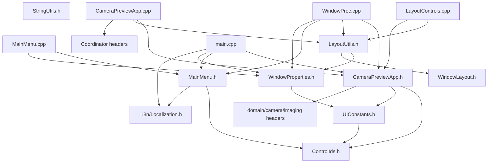

## 用户需求

将 `main.cpp`（8931 行）按职责拆分为独立模块，每个模块职责单一、边界清晰。

## 拆分目标

将当前单文件拆分为 10 个文件：

1. **src/ui/UIConstants.h** — 所有 UI 常量、枚举 `PreviewFrameCacheKind`、结构体 `LiveStitchCaptureRequest`/`LiveStitchCaptureResult`
2. **src/ui/WindowProperties.h** — 面板属性函数 + 语言属性函数（header-only）
3. **src/ui/MainMenu.h/.cpp** — `CreateMainMenu()`、`SyncMainMenu()`
4. **src/ui/StringUtils.h** — 字符串工具函数（header-only）
5. **src/ui/LayoutUtils.h** — 内联函数（InvalidatePreview/InvalidateStatus/GetPreviewRect/GetSidePanelRect/GetStatusRect）+ `LayoutControls()` 声明
6. **src/ui/LayoutControls.cpp** — `LayoutControls()` 实现
7. **src/ui/CameraPreviewApp.h** — `CameraPreviewApp` 类声明 + 成员变量 + `GetApp()`
8. **src/ui/CameraPreviewApp.cpp** — 所有方法实现（约 7800 行）
9. **src/ui/WindowProc.cpp** — `WindowProc` 回调实现
10. **src/main.cpp** — 仅保留 `wWinMain` 入口（约 35 行）

## 核心功能

保持所有函数签名和逻辑不变，纯文件移动重组，不修改任何业务代码。

## 技术方案

### 实现策略

纯代码移动 + 头文件提取，不修改任何业务逻辑和函数签名。遵循现有项目的 Coordinator + Actions 架构，新 UI 基础文件放置在 `src/ui/` 下。

### 关键依赖链处理

**main.cpp 原始 include 顺序：**

```
1-70:   项目头文件 (app/camera/domain/imaging/platform/storage/ui)
71-90:  InvalidatePreview/InvalidateStatus 内联函数
92-96:  CameraViewCoordinator.h 等模板 coordinators
97-100: HistogramCalculator/HistogramRenderer/ImageAdjuster/Localization
102-120: 标准库
122-517: namespace { ... }  常量/结构体/工具函数
521-8375: CameraPreviewApp 类
```

**拆分后 CameraPreviewApp.cpp 的 include 顺序：**

```
#include "CameraPreviewApp.h"           // 自身头文件（含所有项目头文件的 include）
#include "LayoutUtils.h"               // 提供 InvalidatePreview/InvalidateStatus 内联函数
#include "CameraViewCoordinator.h"     // 模板 coordinator 头文件
// ... 其他 coordinator 头文件
#include "imaging/HistogramCalculator.h"
#include "ui/HistogramRenderer.h"
#include "imaging/ImageAdjuster.h"
#include "i18n/Localization.h"
// 标准库已在 CameraPreviewApp.h 中 include
```

**LayoutUtils.h 不依赖 CameraPreviewApp**：`InvalidatePreview`/`InvalidateStatus` 只用到 `GetClientRect`/`InvalidateRect`；`GetPreviewRect`/`GetSidePanelRect`/`GetStatusRect` 只用到 `IsFunctionPanelVisible`/`IsFunctionPanelDockedLeft`/`FunctionPanelWidth` 和 `WindowLayout`，均来自 WindowProperties.h 和 WindowLayout.h。

**WindowProc.cpp** 依赖 CameraPreviewApp.h 获取完整类定义、LayoutUtils.h 获取内联辅助函数、MainMenu.h 获取菜单函数。

### 性能考虑

- `UIConstants.h`、`WindowProperties.h`、`StringUtils.h`、`LayoutUtils.h` 均为 header-only，编译开销低
- `CameraPreviewApp.cpp` 是唯一大文件，编译耗时与拆分前相当（原本全在 main.cpp 中）
- 后续可进一步拆分 CameraPreviewApp 方法，但本次计划不涉及
- 不影响运行时性能

### 模块依赖图



### 目录结构

```
src/ui/
├── [EXISTING] ControlIds.h / WindowLayout.h / ... (40+ files)
├── [NEW] UIConstants.h           — 纯常量定义（~100 行）
├── [NEW] WindowProperties.h      — 面板+语言属性函数（~80 行，header-only）
├── [NEW] MainMenu.h              — 菜单函数声明（~10 行）
├── [NEW] MainMenu.cpp            — 菜单函数实现（~100 行）
├── [NEW] StringUtils.h           — 字符串工具函数（~60 行，header-only）
├── [NEW] LayoutUtils.h           — 几何函数 + LayoutControls 声明（~30 行，half header-only）
├── [NEW] LayoutControls.cpp      — LayoutControls 实现（~100 行）
├── [NEW] CameraPreviewApp.h      — 类声明 + 成员变量 + GetApp（~150 行）
├── [NEW] CameraPreviewApp.cpp    — 所有方法实现（~7800 行）
└── [NEW] WindowProc.cpp          — 窗口过程回调（~390 行）

src/
└── [MODIFY] main.cpp             — 仅 wWinMain（~35 行）

[MODIFY] CMakeLists.txt           — 添加新 .cpp 文件到 CameraView 目标
```

### CMakeLists.txt 修改

在 `add_executable(CameraView WIN32 ...)` 中添加以下源文件：

```
src/ui/MainMenu.cpp
src/ui/LayoutControls.cpp
src/ui/CameraPreviewApp.cpp
src/ui/WindowProc.cpp
```

这些文件不加入 `CAMERAVIEW_DOMAIN_SOURCES`（它们是 Win32 UI 专有，不含领域逻辑）。

## Agent Extensions

### SubAgent

- **code-explorer**
- Purpose: 定位 main.cpp 中各逻辑块的精确行范围边界，验证拆分后文件所需的所有 include 依赖
- Expected outcome: 获取每个待提取代码块的精确起止行号，确认跨文件引用关系无遗漏