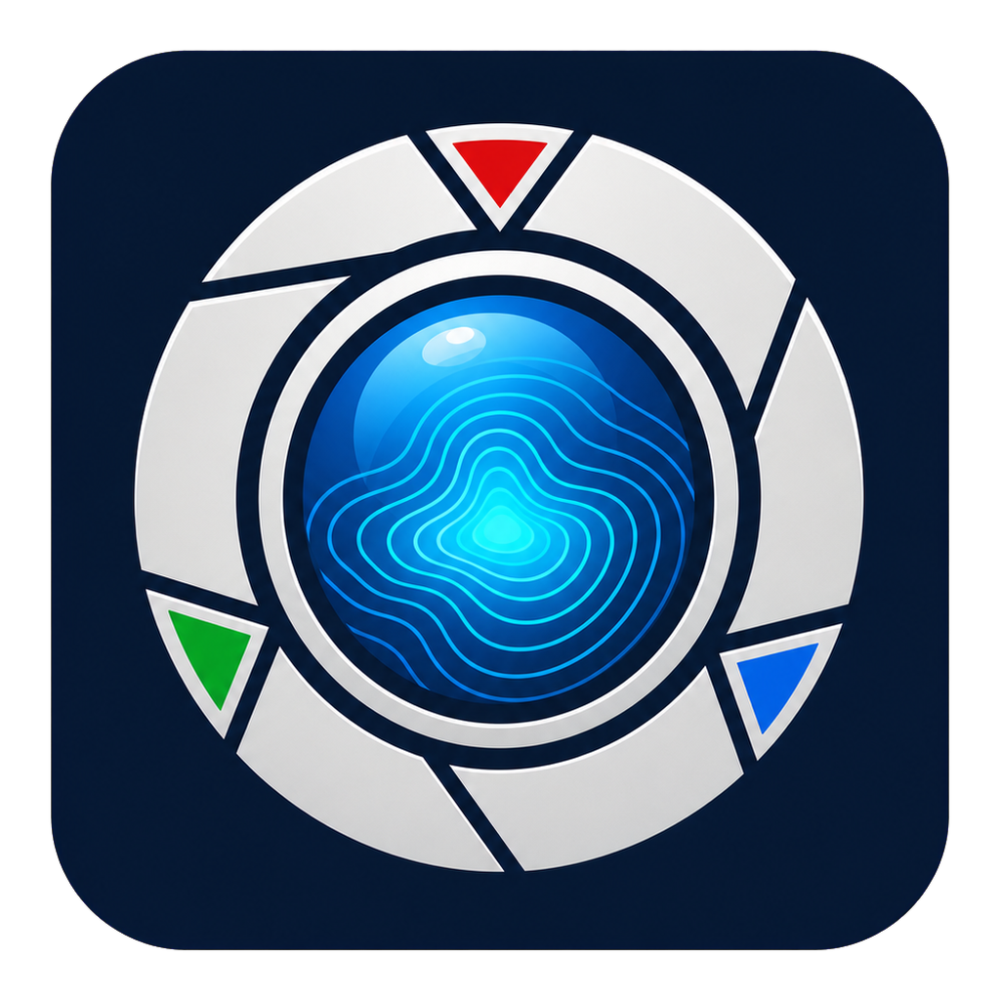

# CameraView - MUCam 工业相机预览

<p align="center">
  
</p>

这是一个按 `MUCam API.pdf` 和 `MUCamSDK` 真实头文件实现的工业相机预览、图像处理与显微测量程序。默认桌面应用已经迁移到 **Qt 6 Widgets**；程序使用 Qt 后台线程加载 Motic MUCam SDK、枚举/打开相机并持续显示采集帧。

## Qt 版本构建

Windows + Qt 6 MinGW 64 位环境可直接运行：

```powershell
.\tools\build_qt.ps1
```

构建结果位于 `build-qt-msvcrt\CameraView.exe`，Qt、MinGW 和 MUCam 运行库会自动部署到同一目录。原 Win32 界面源码仍保留作迁移参考，但不再进入默认构建目标。

Qt 架构、功能映射、手动 CMake 参数和平台边界详见 [`docs/qt_migration.md`](docs/qt_migration.md)。

## YOLO AI 模块

Qt 应用的 `AI` 页签支持基于 Ultralytics YOLO 的目标检测、图像分类、实例分割、模型导入/切换/删除/ONNX 导出，以及带进度、日志、停止控制和最佳权重自动入库的模型训练。

无需管理员权限安装已验证的 CPU 运行环境：

```powershell
.\tools\setup_yolo.ps1 -CpuOnly
```

随后正常构建并启动应用，打开图片，在 AI 页签导入对应的 `.pt` 或 `.onnx` 模型即可。数据集结构、GPU 环境、训练参数和诊断命令详见 [`docs/yolo_ai_module.md`](docs/yolo_ai_module.md)。

## 已实现

- 优先动态加载 `MUCam32Ex.dll`，兼容旧版 `MUCam32.dll`
- 已新增 `ICameraDriver` 和 `MUCamCameraDriver`，主窗口通过相机驱动接口枚举、打开、取帧和设置曝光
- 已新增 `CameraDeviceListFormatter`，统一相机设备下拉框的占位文本、设备显示文本和选择索引校验
- 已新增 `FrameBuffer`，采集线程通过统一缓冲发布最新帧，UI 读取稳定快照
- 已新增 `WindowLayout`、`WindowControlLayout` 和 `WindowControlDefinitions`，分别封装窗口区域计算、工具栏/右侧面板控件摆放和控件创建定义
- 右侧功能面板使用可收缩卡片归类 Camera、Image、Fluorescence、Processing、Measurement、Project；Camera 卡可调自动曝光、曝光、增益和白平衡，窗口变宽时侧栏会自适应加宽
- 已新增 `MeasurementActionApplier` 和 `MeasurementInteractionActions`，封装测量交互动作到标定/测量对象的应用规则，以及点击/完成多边形后的状态、列表和预览刷新结果
- 已新增 `MeasurementInteractionState`，封装标定、长度、角度、矩形面积和多边形面积工具的点位采集状态
- 已新增 `MeasurementHitTester`，封装测量端点/顶点拖拽编辑的命中检测
- 已新增 `MeasurementEditSession`，封装测量点拖拽编辑会话和点位更新规则
- 已新增 `MeasurementOverlayModelBuilder`，统一把测量集合、标定和待完成测量状态组装为叠加绘制模型
- 已新增 `MeasurementDisplayActions`，统一测量显示单位、结果列表文本、选中测量映射和叠加绘制模型入口
- 已新增 `MeasurementToolAvailability` 和 `MeasurementToolStartActions`，统一标定和测量工具启动前的预览帧可用性检查、输入校验、交互状态切换与提示文本
- 已新增 `ImageViewport`，封装图像绘制和图像/屏幕坐标换算；滚轮缩放、拖拽平移和视口平移会话状态由 `ViewportInteractionActions` 统一封装
- 已新增 `OverlayRenderer`，封装长度、角度、面积测量叠加和待完成测量点绘制
- 支持枚举已连接相机，在界面下拉框中选择要打开的设备
- 按 SDK 示例流程调用 `MUCamEx_findCamera`、`MUCamEx_openCamera`、`MUCamEx_getBinningList`、`MUCamEx_setBinningIndex`、`MUCamEx_getFrame`
- 默认设置 binning 0、自由触发；旧版 DLL 支持时额外设置 8-bit
- 支持 BGR、RGB、单色显示
- Bayer 图像会优先调用 `MUCamEx_getBayerFormat`、`MUCamEx_getBayer`、`MUCamEx_bayer2RGB` 转 RGB；如果 DLL 不导出相关函数，则以灰度预览
- 支持打开、停止、曝光时间设置
- 实时预览采用三槽复用帧池、带所有权的共享 `QImage` 直达画布和“消费后立即取下一帧”的单帧背压；移除了固定 15 ms 轮询上限，默认显示不再逐帧分配/复制大图或生成灰度/直方图，AI 预览只在 AI 页激活时刷新
- 状态栏右侧显示 SDK 加载诊断和真实预览遥测，包括 DLL、接口类型、可选能力、设备、相机类型、分辨率、FPS 和帧时间戳；预览遥测文本由 `CameraTelemetryFormatter` 统一生成，相机断开时会保留断开提示，便于现场验证
- 相机控制区的设备刷新、设备选择、曝光输入校验、曝光夹取和状态结果由 `CameraPanelActions` 统一封装，设备列表显示由 `CameraDeviceListFormatter` 生成，枚举、选择、打开和曝光设置提示由 `CameraControlStatusFormatter` 生成
- 支持鼠标滚轮按光标位置实时缩放图像，缩放输入由 `ViewportInteractionActions` 校验和转发，状态栏会显示当前缩放倍率
- 支持右键或鼠标中键拖拽平移放大后的图像，平移开始、拖动和结束状态由 `ViewportInteractionActions` 维护
- 支持工具栏 `Fit` 按钮一键恢复完整图像视图，便于放大观察后快速回到全图
- 已开始按显微观察与测量软件设计拆分基础模块：`ImageFrame`、`CameraDevice`、`CameraPanelActions`、`CameraDeviceListFormatter`、`CameraControlStatusFormatter`、`CameraTelemetryFormatter`、`FrameBuffer`、`DiagnosticReportActions`、`ExportActions`、`ProjectActions`、`MeasurementActionApplier`、`MeasurementDisplayActions`、`MeasurementInteractionActions`、`MeasurementInteractionState`、`MeasurementHitTester`、`MeasurementEditSession`、`MeasurementListActions`、`MeasurementListSelection`、`MeasurementOverlayModelBuilder`、`MeasurementToolAvailability`、`MeasurementToolStartActions`、`MeasurementCollection`、`MeasurementFormatter`、`MeasurementNameFormatter`、`MeasurementCsvExporter`、`DiagnosticReportBuilder`、`ProjectSessionMapper`、`ProjectSessionRestorer`、`FileDialog`、`TextInputParser`、`DyeProfileFormParser`、`DyeProfileFormPresenter`、`DyeLibraryActions`、`DyeLibrary`、`FluorescenceDisplayActions`、`FluorescenceChannelFactory`、`FluorescenceChannelFormPresenter`、`FluorescenceChannelListActions`、`FluorescenceChannelSettings`、`FluorescenceChannelUpdater`、`FluorescenceFormatter`、`ProcessingParameterRules`、`ProcessingBuildActions`、`ProcessingBuildInputActions`、`ProcessingQueueActions`、`ProcessingStartActions`、`ProcessingProgressActions`、`ProcessingWorkerActions`、`ProcessingJobExecutor`、`ProcessingProgressThrottle`、`ProcessingPanelActions`、`ProcessingRetryActions`、`ProcessingResultActions`、`ProcessingStatusFormatter`、`PreviewDisplayActions`、`PreviewFrameComposer`、`ProcessingJobState`、`ProcessingResultFrames`、`ProcessingRetryState`、`StitchTileListActions`、`StitchTilePlacementPlanner`、`EdfStackListActions`、`ViewportInteractionActions`、`ControlIds`、`WindowLayout`、`WindowControlLayout`、`WindowControlDefinitions`、`ImageViewport`、`OverlayRenderer`、`ViewTransform`
- 已加入图像坐标转换、两点标定，以及点坐标、长度、折线长度、角度、矩形、多边形、圆和椭圆测量；支持为 4x、10x、20x、40x、60x、100x 物镜分别保存标定比例，切换物镜时自动恢复并重新计算测量结果，重启后仍会记忆；矩形/椭圆显示宽高、周长和面积，圆显示半径、直径、周长和面积
- 右侧测量面板支持自动寻边吸附和搜索半径调节；绘制时可预览待完成形状，结果列表可单击高亮、双击定位，并支持 F2 重命名和 Delete 删除
- 测量工具采用统一的图形按钮网格，点、长度、折线、角度、矩形、多边形、圆、椭圆和剖线均由 Qt 按功能动态绘制专属矢量图标，并显示当前选中状态
- 独立测量工具栏集中提供标定、全部九种测量、智能框选/计数、自动寻边、删除、清空和 CSV 导出，侧栏仍保留带说明的完整操作区
- 图像页新增非破坏性处理链，支持灰度、反相、自动对比度、直方图均衡、高斯平滑、中值降噪、反锐化增强、边缘检测和二值化，可逐步撤销或一键恢复原图
- 已新增少样本智能目标计数：用户连续框选一个或多个典型目标后，OpenCV 后台引擎会使用矩形样本内的完整灰度与边缘特征进行多样本、多尺度匹配，支持圆形、方形、细长形和不规则目标，并通过重复抑制去重
- 已新增 `MeasurementFormatter`，统一测量结果列表、状态栏和叠加绘制中的测量文本格式
- 已新增 `MeasurementNameFormatter`，统一长度、角度、矩形面积和多边形面积测量对象的默认命名规则
- 已新增 `MeasurementListActions` 和 `MeasurementListSelection`，统一测量结果列表删除、重命名、选中索引和删除后的下一项选择规则
- 已新增 `TextInputParser`，统一曝光时间、标定长度、染料参数、通道范围、拼接搜索范围和 EDF 半径等输入解析规则
- 已新增 `FileDialog`，统一 CSV、BMP、诊断报告和项目文件的保存/打开对话框
- 支持通过 `Open Image` 打开未压缩 8 位灰度/调色板 BMP、24 位 BMP 或 32 位 BGRA BMP，作为当前帧进行测量、伪彩、融合、拼接和 EDF 离线验证；打开离线图像时会取消并忽略旧后台处理结果，状态栏和遥测区会显示载入图像尺寸
- 支持测量结果重命名；点击预览图中的测量覆盖层可同步选中列表项，拖动白边控制点可修改形状，拖动线条或图形内部可整体移动；每个测量项均可设置或恢复独立颜色，颜色会同步用于画布和图像导出
- 支持删除选中的测量结果，并通过 `ExportActions` 和 `MeasurementCsvExporter` 将长度、角度、面积测量表导出为 CSV
- 支持通过 `ProjectActions` 保存和打开项目文件，恢复各物镜标定比例、当前选中物镜、全部八类测量列表及各自覆盖层颜色、荧光染料资料、荧光通道配置，以及拼接的排列、网格、重叠率、配准、变换、融合和实时采集间隔；打开项目时会清理旧拼接/EDF 运行态
- 支持导出带全部测量类型叠加的图像；测量 CSV 同时记录当前物镜倍率、点位、原始像素值、标定单位和各形状的详细指标
- 支持通过 `DiagnosticReportActions` 收集现场诊断状态，并由 `DiagnosticReportBuilder` 生成诊断报告文本，记录 SDK、设备列表和选中设备、当前帧来源、视口缩放、当前预览显示模式、帧信息、标定、测量、处理队列以及拼接/EDF 结果类型、当前显示来源和尺寸信息
- 支持实时图像伪彩显示，伪彩下拉显示、选择状态、预览模式标签和状态栏文本由 `PreviewDisplayActions` 统一封装，伪彩映射由 `PseudoColorMapper` 提供，并通过 `PreviewFrameComposer` 与融合/处理结果统一生成当前预览帧
- 支持默认荧光染料资料、自定义染料新增/更新/删除、当前帧添加为荧光通道、多通道融合预览、融合效果导出，以及通道删除、单通道隔离和全部恢复；新增面向显微荧光的 1%–99.8% 稳健分位自动拉伸、原始强度范围/均值/饱和比例统计和欠曝、低对比度、饱和提示，所有显示拉伸均不修改原始像素；融合可选择加法、减少硬饱和的屏幕模式或最大值模式。染料输入解析由 `DyeProfileFormParser` 统一维护，染料资料表单显示文本由 `DyeProfileFormPresenter` 统一维护，染料资料保存/删除动作、状态文本和删除后选择项由 `DyeLibraryActions` 统一维护，染料库的同名更新、删除后选择项和默认空通道染料由 `DyeLibrary` 统一维护，染料下拉文本、当前染料选择、通道列表文本和通道选中索引由 `FluorescenceDisplayActions` 统一维护，按染料和当前帧创建默认通道由 `FluorescenceChannelFactory` 统一维护，通道分析由 `FluorescenceChannelAnalysis` 提供，通道设置表单显示文本由 `FluorescenceChannelFormPresenter` 统一维护，通道增删、隔离、恢复和清空后的融合预览与列表选择规则由 `FluorescenceChannelListActions` 统一维护，通道可见性、黑白范围和列表索引规则由 `FluorescenceChannelSettings` 统一维护，通道设置应用和错误状态由 `FluorescenceChannelUpdater` 统一维护，荧光通道默认名称、染料和通道列表文本由 `FluorescenceFormatter` 统一生成
- 常用阈值和连续参数采用带实时数值读数的拖动条：覆盖快速滤镜参数、荧光黑白电平、拼接重叠率与检测间隔、自动寻边半径、智能计数阈值，以及 YOLO 置信度和 IOU；离散计数和高精度标定参数继续使用数字输入框
- 支持当前帧、多文件、目录和多文件拖放加入拼接队列；目录按自然数字顺序导入并跳过 `_` 临时文件。支持网格/线性排列、五种配准、三种变换、融合模式、后台进度/取消、重试上次拼接，以及随结果导出的 `.stitch.txt` 位姿元数据；实时拼接提供相机小窗、连续失配告警和缩略 tile 缓存；同时保留 EDF 景深扩展和焦点图工作流
- 已新增 `ProcessingJobState`，统一管理后台拼接/EDF 作业编号、取消令牌、运行状态和待发布结果
- 已新增 `ProcessingResultFrames`，统一管理拼接结果、EDF 合成图、EDF 焦点图、当前处理结果显示状态和显示来源标签，并可在 `EDF Image` 与 `Focus Map` 之间切换
- 已新增 `ProcessingRetryState`，统一管理拼接/EDF 后台任务的重试快照和有效性判断
- 支持通过状态栏查看拼接/EDF 后台处理进度，可用 `Retry` 重试上一后台作业，并可用 `Clear Processing` 清空队列、请求取消正在运行的后台作业；拼接/EDF 作业启动准备由 `ProcessingStartActions` 统一封装，后台 worker 线程创建由 `ProcessingWorkerActions` 统一封装，作业执行由 `ProcessingJobExecutor` 统一封装，后台完成结果的旧作业忽略、失败状态和成功发布由 `ProcessingResultActions` 统一维护，显示 EDF 合成图、焦点图和清空处理队列动作由 `ProcessingPanelActions` 统一维护，重试请求判定和重试提示由 `ProcessingRetryActions` 统一维护，后台处理状态文本由 `ProcessingStatusFormatter` 统一生成，取消检查和进度上报判定由 `ProcessingProgressActions` 统一维护，进度刷新节流由 `ProcessingProgressThrottle` 统一维护
- 已新增 `GeometryOps` 和 `StringOps` 无状态工具类，集中坐标换算（RectWidth/RectHeight/FitScale）与字符串 Trim 等重复逻辑，`TextInputParser` 和 `DiagnosticReportActions` 已委托到统一的 `platform::Trim()`
- 已新增 `CameraViewCoordinator`、`FluorescenceViewCoordinator`、`MeasurementViewCoordinator`、`ProcessingViewCoordinator`、`ViewportViewCoordinator` 五个面板协调类，将 main.cpp WndProc 中各功能面板（相机/荧光/测量/处理/视口）的 WM_COMMAND 消息派发下沉到独立协调类；main.cpp 退化为窗口创建、消息路由与全局装配
- 性能优化：`FrameBuffer::Publish()` 复用 shared_ptr 减少高帧率堆分配；`HistogramCalculator` 合并多趟扫描为像素遍历中追踪 min/max/mean；`PreviewFrameComposer` 新增 `ComposeInto()` 接口复用输出缓冲避免中间临时对象
- 已清理 main.cpp 中未编译使用的 `src/ai/*.h` include，AI 面板 16 个方法及 WM_COMMAND 分支从 main.cpp 完全隔离（约 950 行），不影响构建
- 单元测试 `CameraViewDomainTests` 扩展覆盖：GeometryOps（坐标换算与 FitScale 边界）、StringOps（Trim 多场景）、TextInputParser（数值解析边界）、ProcessingParameterRules（拼接/EDF 参数验证）、Measurement 族（长度/角度/矩形/多边形面积属性与计算）
- 已加入核心逻辑自动验证目标 `CameraViewDomainTests`
- 核心领域测试不依赖 Qt、OpenCV 或厂家 `.lib` 文件；默认桌面前端依赖 Qt 6 Widgets
- Qt AI 工作台通过独立 Python 进程接入标准 Ultralytics YOLO，支持检测、分类、分割、训练、模型注册表和 ONNX 导出；推理结果可叠加显示并随图像导出

## 智能目标计数

1. 打开静态图像，或连接相机后进入“测量”页。
2. 在“智能目标计数”中点击“开始框选样本”，选择目标外接矩形的两个对角点；可连续框选多个外观略有差异的典型目标。
3. 根据目标差异调节“相似度阈值”和“尺寸变化范围”，然后点击“自动查找并计数”。
4. 绿色编号框表示自动识别结果；列表显示置信度，双击任一结果可自动放大并定位。阈值越低召回越多，阈值越高误检越少。
5. 实时相机画面会在框选期间冻结为当前帧，点击“清除”后恢复实时预览。

## 快速图像处理

1. 打开静态图像或连接相机，进入“图像”页的“快速图像处理”。
2. 选择处理功能；高斯平滑、中值降噪、反锐化增强、边缘检测和二值化可调节对应参数。
3. 点击“添加到处理链”可按顺序叠加多个处理步骤，当前处理链会实时应用于静态图像和相机画面，并随图像导出。
4. “撤销一步”移除最后一个处理，“恢复原图”清空处理链；亮度、对比度、伽马、窗位/窗宽和伪彩仍可与处理链组合使用。

## 显微观察与测量软件实现阶段

当前项目正在从相机预览程序演进为显微观察和测量软件。架构设计和 UML 建模资料已放在 `docs/`，用户已确认默认方案，代码已进入第一阶段基础模块拆分。

设计入口：

- `docs/design_index.md`：设计文档总索引和推荐阅读顺序
- `docs/design_confirmation.md`：已确认的默认方案
- `docs/architecture_uml.md`：架构设计和 UML 说明
- `docs/requirements_traceability.md`：需求、模块和 UML 追踪矩阵
- `docs/uml/README.md`：PlantUML 图源索引
- `docs/uml_gallery.md`：已渲染 PNG 图集索引
- `docs/implementation_progress.md`：设计确认后的代码实现进度
- `docs/camera_field_verification.md`：连接真实相机后的现场预览验证清单

UML 源码级检查：

```powershell
.\tools\render_uml.ps1 -Mode check
```

如已安装 PlantUML，可用同一脚本渲染 PNG 或 SVG，具体见 `docs/uml_rendering.md`。

当前 PNG 渲染结果位于 `docs\uml\rendered\`。

## 运行前准备

1. 安装 Qt 6 的 MinGW 64 位套件，并准备 CMake、Ninja 与匹配 Qt ABI 的 MinGW/MSVCRT 编译器。
2. 执行 `.\tools\build_qt.ps1`；脚本会自动探测本机工具链。
3. 生成过程会把 Qt、MinGW 和 `MUCamSDK\bin\x64` 中的 MUCam DLL 部署到输出目录。
4. 连接相机，运行 `build-qt-msvcrt\CameraView.exe`。没有相机时也可打开离线图像使用测量和处理功能。

## 构建方式

推荐方式：

```powershell
.\tools\build_qt.ps1
```

## 注意事项

- 程序用动态加载方式调用 DLL，因此不需要链接 `MUCam32Ex.lib`。
- 当前 Qt 版本已用 Qt 6.9、MinGW/MSVCRT x64 与 CMake Release 编译，并通过领域测试和 Qt 启动测试；连接真实相机时仍需按 `docs/camera_field_verification.md` 完成硬件现场验证。
- 如果运行时提示未找到相机，请先运行厂家自带的 `MUCamSDK\bin\x86\MUCamExample.exe` 或 `MUCamSDK\bin\x64\MUCamExample.exe` 检查驱动和相机连接。
