# 显微观察与测量软件架构设计及 UML

本文档是架构设计稿。当前架构、模块边界和 UML 模型已被用户确认，代码已进入第一阶段基础拆分。

独立 UML 源文件位于 `docs/uml/`，可用 PlantUML 单独渲染。本文档中的 Mermaid 图用于快速阅读，`docs/uml/*.puml` 用于正式图源管理。

配套评审文档：

- `docs/design_index.md`：设计资料总入口和阅读顺序。
- `docs/design_completion_audit.md`：设计完成证据和当前实现进度审计。
- `docs/requirements_traceability.md`：需求、模块、领域对象和 UML 图源的追踪矩阵。
- `docs/uml/README.md`：独立 PlantUML 图源索引。
- `docs/uml_gallery.md`：已渲染 PNG 图集索引。
- `docs/uml_rendering.md`：UML 渲染和复核说明。
- `docs/design_confirmation.md`：已确认的设计决策清单。
- `docs/design_review_report.md`：当前设计完成度、UML 覆盖和验证结果。
- `docs/image_processing_design.md`：伪彩、荧光融合、拼接和 EDF 的算法设计约束。
- `docs/implementation_plan.md`：用户确认后的阶段化实现计划。
- `docs/implementation_progress.md`：用户确认后的代码实现进度。
- `docs/architecture_decisions.md`：当前架构决策记录。
- `docs/acceptance_checklist.md`：设计确认和后续实现验收检查表。

## 1. 设计目标

软件面向显微观察、实时预览、图像标定和几何测量。第一阶段在现有 `CameraView` 基础上演进，保留 MUCam SDK 动态加载能力，同时把当前单体窗口逻辑拆成可维护模块。

核心目标：

- 支持 MUCam 相机枚举、选择、打开、停止、曝光设置和实时取帧。
- 支持实时图像显示、缩放、后续扩展平移、适配窗口和叠加绘制。
- 支持显微标定，将像素距离转换为真实单位。
- 支持基础测量对象：长度、折线长度、矩形、圆/直径、角度、面积。
- 支持图像伪彩、荧光通道融合和荧光染料资料管理。
- 支持图像拼接和 EDF 景深扩展，保留源图与处理参数。
- 支持测量结果列表、编辑、删除、保存、导出。
- 保证 UI 线程、采集线程、测量计算和持久化之间边界清晰。

## 2. 当前项目现状

当前代码主要由三部分组成：

| 文件 | 当前职责 | 后续处理 |
| --- | --- | --- |
| `src/main.cpp` | Win32 窗口、控件、采集线程、绘制、缩放、状态提示 | 拆分为 UI、应用服务、渲染、采集控制 |
| `src/MUCamApi.h/.cpp` | 动态加载 MUCam DLL，并封装 SDK 函数指针 | 保留为 `MUCamCameraDriver` 的底层适配 |
| `CMakeLists.txt` | 构建可执行程序并复制 DLL | 扩展为多模块源文件结构 |

## 3. 分层架构

建议采用轻量分层架构，不一次性引入大型框架。

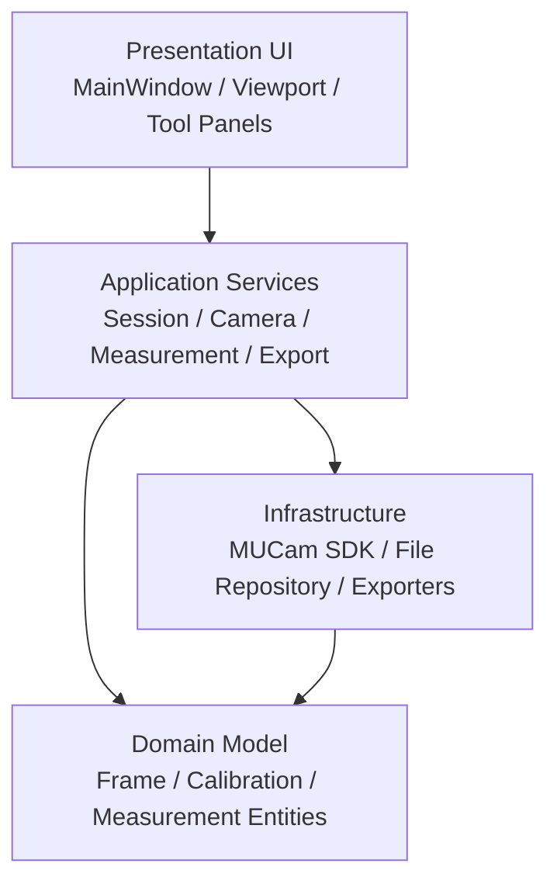

### 分层说明

| 层 | 职责 | 不应该承担的职责 |
| --- | --- | --- |
| Presentation | 用户交互、控件布局、鼠标事件、图像视口、测量工具栏 | 直接调用相机 SDK、直接计算测量单位 |
| Application | 编排业务流程：打开相机、接收帧、创建测量、保存项目 | 具体 Win32 绘制细节、DLL 函数指针 |
| Domain | 表达核心概念：图像帧、标定、测量实体、测量结果 | 窗口句柄、文件路径、SDK 句柄 |
| Infrastructure | 相机驱动适配、文件存储、图片/CSV/报告导出 | UI 状态、鼠标交互 |

## 4. 建议目录结构

```text
src/
  app/
    ObservationSession.h/.cpp
    CameraController.h/.cpp
    MeasurementController.h/.cpp
    CalibrationService.h/.cpp
    ImageProcessingService.h/.cpp
    ChannelFusionService.h/.cpp
    DyeLibraryService.h/.cpp
    StitchingService.h/.cpp
    EdfService.h/.cpp
    ProcessingQueue.h/.cpp
    ExportService.h/.cpp
    DiagnosticReportActions.h/.cpp
    ExportActions.h/.cpp
    ProjectActions.h/.cpp
    ProjectSessionRestorer.h/.cpp
  camera/
    ICameraDriver.h
    MUCamCameraDriver.h/.cpp
    CameraDevice.h
    CameraDeviceListFormatter.h/.cpp
    CameraControlStatusFormatter.h/.cpp
    CameraTelemetryFormatter.h/.cpp
    FrameBuffer.h/.cpp
  domain/
    ImageFrame.h
    ImageStack.h
    FluorescenceChannel.h
    DyeProfile.h
    ChannelFusionRecipe.h
    CalibrationProfile.h
    MeasurementEntity.h/.cpp
    MeasurementCollection.h/.cpp
    MeasurementFormatter.h/.cpp
    MeasurementNameFormatter.h/.cpp
    MeasurementResult.h
    StitchingProject.h
    EdfResult.h
    ProcessingJob.h
    ProjectDocument.h
  imaging/
    ImageConverter.h/.cpp
    ViewTransform.h/.cpp
    ImageViewport.h/.cpp
    ViewportInteractionActions.h/.cpp
    OverlayRenderer.h/.cpp
    PreviewDisplayActions.h/.cpp
    PreviewFrameComposer.h/.cpp
    PseudoColorMapper.h/.cpp
    DyeLibrary.h/.cpp
    FluorescenceChannelFactory.h/.cpp
    FluorescenceChannelListActions.h/.cpp
    FluorescenceChannelSettings.h/.cpp
    FluorescenceChannelUpdater.h/.cpp
    FluorescenceFormatter.h/.cpp
    ProcessingParameterRules.h/.cpp
    ProcessingBuildActions.h/.cpp
    ProcessingStartActions.h/.cpp
    StitchTileListActions.h/.cpp
    StitchTilePlacementPlanner.h/.cpp
    EdfStackListActions.h/.cpp
    ProcessingProgressActions.h/.cpp
    ProcessingWorkerActions.h/.cpp
    ProcessingProgressThrottle.h/.cpp
    ProcessingJobExecutor.h/.cpp
    ChannelFusionEngine.h/.cpp
    ImageRegistration.h/.cpp
    ImageStitcher.h/.cpp
    EdfProcessor.h/.cpp
    ProcessingPanelActions.h/.cpp
    ProcessingJobState.h/.cpp
    ProcessingResultActions.h/.cpp
    ProcessingResultFrames.h/.cpp
    ProcessingRetryActions.h/.cpp
    ProcessingRetryState.h/.cpp
    ProcessingStatusFormatter.h/.cpp
  ui/
    MainWindow.h/.cpp
    ControlIds.h
    WindowLayout.h/.cpp
    WindowControlLayout.h/.cpp
    WindowControlDefinitions.h/.cpp
    CameraPanelActions.h/.cpp
    MeasurementActionApplier.h/.cpp
    MeasurementDisplayActions.h/.cpp
    MeasurementInteractionActions.h/.cpp
    MeasurementInteractionState.h/.cpp
    MeasurementHitTester.h/.cpp
    MeasurementEditSession.h/.cpp
    MeasurementListActions.h/.cpp
    MeasurementListSelection.h/.cpp
    MeasurementOverlayModelBuilder.h/.cpp
    MeasurementToolAvailability.h/.cpp
    MeasurementToolStartActions.h/.cpp
    DyeLibraryActions.h/.cpp
    DyeProfileFormPresenter.h/.cpp
    DyeProfileFormParser.h/.cpp
    FluorescenceDisplayActions.h/.cpp
    FluorescenceChannelFormPresenter.h/.cpp
    ProcessingBuildInputActions.h/.cpp
    ProcessingQueueActions.h/.cpp
    CameraPanel.h/.cpp
    MeasurementPanel.h/.cpp
    CalibrationDialog.h/.cpp
    ChannelPanel.h/.cpp
    ProcessingPanel.h/.cpp
    StitchingPanel.h/.cpp
    EdfPanel.h/.cpp
  storage/
    DyeRepository.h/.cpp
    ProjectRepository.h/.cpp
    ProjectSessionMapper.h/.cpp
    MeasurementCsvExporter.h/.cpp
    DiagnosticReportBuilder.h/.cpp
    ImageExporter.h/.cpp
  platform/
    Win32Helpers.h/.cpp
    FileDialog.h/.cpp
    TextInputParser.h/.cpp
```

## 5. UML 用例图

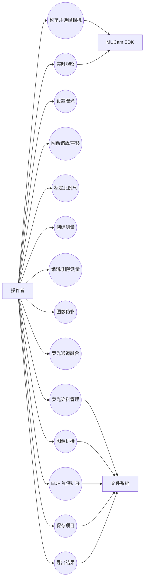

## 6. UML 组件图

```mermaid
flowchart TB
    subgraph Presentation
        MainWindow
        ControlIds
        WindowLayout
        WindowControlLayout
        WindowControlDefinitions
        CameraPanelActions
        MeasurementActionApplier
        MeasurementDisplayActions
        MeasurementInteractionActions
        MeasurementInteractionState
        MeasurementHitTester
        MeasurementEditSession
        MeasurementListActions
        MeasurementListSelection
        MeasurementOverlayModelBuilder
        MeasurementToolAvailability
        MeasurementToolStartActions
        DyeLibraryActions
        DyeProfileFormPresenter
        DyeProfileFormParser
        FluorescenceDisplayActions
        FluorescenceChannelFormPresenter
        ProcessingBuildInputActions
        ProcessingQueueActions
        ImageViewport
        ViewportInteractionActions
        CameraPanel
        MeasurementPanel
        CalibrationDialog
        ChannelPanel
        ProcessingPanel
        StitchingPanel
        EdfPanel
    end

    subgraph Application
        ObservationSession
        CameraController
        MeasurementController
        CalibrationService
        ImageProcessingService
        ChannelFusionService
        DyeLibraryService
        StitchingService
        EdfService
        ProcessingQueue
        ExportService
        DiagnosticReportActions
        ExportActions
        ProjectActions
        ProjectSessionRestorer
    end

    subgraph Domain
        ImageFrame
        ImageStack
        FluorescenceChannel
        DyeProfile
        ChannelFusionRecipe
        CalibrationProfile
        MeasurementEntity
        MeasurementCollection
        MeasurementResult
        MeasurementFormatter
        MeasurementNameFormatter
        StitchingProject
        EdfResult
        ProcessingJob
        ProjectDocument
    end

    subgraph ImageProcessing
        OverlayRenderer
        PreviewDisplayActions
        PreviewFrameComposer
        PseudoColorMapper
        DyeLibrary
        FluorescenceChannelFactory
        FluorescenceChannelListActions
        FluorescenceChannelSettings
        FluorescenceChannelUpdater
        ProcessingParameterRules
        ProcessingBuildActions
        ProcessingStartActions
        StitchTileListActions
        StitchTilePlacementPlanner
        EdfStackListActions
        ProcessingProgressActions
        ProcessingWorkerActions
        ProcessingProgressThrottle
        ProcessingJobExecutor
        ChannelFusionEngine
        ImageRegistration
        ImageStitcher
        EdfProcessor
        ProcessingPanelActions
        ProcessingJobState
        ProcessingResultActions
        ProcessingResultFrames
        ProcessingRetryActions
        ProcessingRetryState
        ProcessingStatusFormatter
    end

    subgraph Infrastructure
        ICameraDriver
        MUCamCameraDriver
        DyeRepository
        ProjectRepository
        ProjectSessionMapper
        MeasurementCsvExporter
        DiagnosticReportBuilder
        ImageExporter
        FileDialog
    end

    MainWindow --> CameraPanel
    MainWindow --> ControlIds
    MainWindow --> WindowLayout
    MainWindow --> WindowControlLayout
    MainWindow --> WindowControlDefinitions
    MainWindow --> CameraPanelActions
    MainWindow --> MeasurementInteractionActions
    MainWindow --> MeasurementInteractionState
    MainWindow --> MeasurementHitTester
    MainWindow --> MeasurementEditSession
    MainWindow --> MeasurementListActions
    MainWindow --> MeasurementDisplayActions
    MainWindow --> MeasurementToolAvailability
    MainWindow --> MeasurementToolStartActions
    MainWindow --> DyeLibraryActions
    MainWindow --> DyeProfileFormPresenter
    MainWindow --> DyeProfileFormParser
    MainWindow --> FluorescenceChannelFormPresenter
    MainWindow --> FluorescenceDisplayActions
    MainWindow --> MeasurementNameFormatter
    MainWindow --> ImageViewport
    MainWindow --> ViewportInteractionActions
    MainWindow --> PreviewDisplayActions
    MainWindow --> ProcessingBuildInputActions
    MainWindow --> ProcessingQueueActions
    MainWindow --> ProcessingStartActions
    MainWindow --> ProcessingWorkerActions
    MainWindow --> ProcessingPanelActions
    MainWindow --> ProcessingResultActions
    MainWindow --> ProcessingResultFrames
    MainWindow --> ProcessingRetryActions
    MainWindow --> ProcessingRetryState
    MainWindow --> FluorescenceChannelListActions
    MainWindow --> ProjectActions
    MainWindow --> ProjectSessionRestorer
    MainWindow --> MeasurementPanel
    MainWindow --> ChannelPanel
    MainWindow --> ProcessingPanel
    MainWindow --> StitchingPanel
    MainWindow --> EdfPanel
    MainWindow --> FileDialog
    MainWindow --> DiagnosticReportActions
    MainWindow --> ExportActions
    CameraPanel --> CameraController
    CameraPanelActions --> CameraDeviceListFormatter
    CameraPanelActions --> CameraControlStatusFormatter
    CameraPanelActions --> TextInputParser
    ViewportInteractionActions --> ImageViewport
    ImageViewport --> ObservationSession
    ImageViewport --> MeasurementController
    MeasurementPanel --> MeasurementController
    CalibrationDialog --> CalibrationService
    ChannelPanel --> ChannelFusionService
    ChannelPanel --> DyeLibraryService
    ProcessingPanel --> ImageProcessingService
    StitchingPanel --> StitchingService
    EdfPanel --> EdfService

    ObservationSession --> CameraController
    ObservationSession --> MeasurementController
    ObservationSession --> ImageProcessingService
    CameraController --> ICameraDriver
    MUCamCameraDriver -. implements .-> ICameraDriver
    MeasurementController --> CalibrationService
    MeasurementController --> MeasurementCollection
    MeasurementCollection --> MeasurementEntity
    MeasurementActionApplier --> MeasurementInteractionState
    MeasurementActionApplier --> MeasurementCollection
    MeasurementActionApplier --> CalibrationProfile
    MeasurementInteractionActions --> MeasurementActionApplier
    MeasurementInteractionActions --> MeasurementInteractionState
    MeasurementInteractionActions --> MeasurementCollection
    MeasurementInteractionActions --> CalibrationProfile
    MeasurementFormatter --> MeasurementCollection
    MeasurementFormatter --> MeasurementResult
    MeasurementNameFormatter --> MeasurementCollection
    MeasurementEditSession --> MeasurementHitTester
    MeasurementEditSession --> MeasurementCollection
    MeasurementListActions --> MeasurementCollection
    MeasurementListActions --> MeasurementListSelection
    MeasurementDisplayActions --> MeasurementCollection
    MeasurementDisplayActions --> CalibrationProfile
    MeasurementDisplayActions --> MeasurementInteractionState
    MeasurementDisplayActions --> MeasurementFormatter
    MeasurementDisplayActions --> MeasurementListSelection
    MeasurementDisplayActions --> MeasurementOverlayModelBuilder
    MeasurementOverlayModelBuilder --> MeasurementCollection
    MeasurementOverlayModelBuilder --> MeasurementInteractionState
    MeasurementOverlayModelBuilder --> OverlayRenderer
    MeasurementToolAvailability --> ImageFrame
    MeasurementToolStartActions --> MeasurementToolAvailability
    MeasurementToolStartActions --> MeasurementInteractionState
    MeasurementToolStartActions --> CalibrationProfile
    DyeProfileFormParser --> TextInputParser
    DyeProfileFormParser --> DyeProfile
    DyeLibraryActions --> DyeProfileFormParser
    DyeLibraryActions --> DyeLibrary
    DyeLibraryActions --> DyeProfile
    DyeProfileFormPresenter --> DyeProfile
    FluorescenceDisplayActions --> DyeLibrary
    FluorescenceDisplayActions --> DyeProfile
    FluorescenceDisplayActions --> FluorescenceChannel
    FluorescenceDisplayActions --> FluorescenceFormatter
    FluorescenceDisplayActions --> FluorescenceChannelSettings
    FluorescenceChannelFormPresenter --> FluorescenceChannel
    WindowControlLayout --> ControlIds
    WindowControlLayout --> WindowLayout
    ImageProcessingService --> PreviewFrameComposer
    PreviewDisplayActions --> PreviewFrameComposer
    PreviewDisplayActions --> PseudoColorMapper
    PreviewDisplayActions --> ProcessingResultFrames
    PreviewDisplayActions --> FluorescenceChannel
    PreviewFrameComposer --> PseudoColorMapper
    PreviewFrameComposer --> ChannelFusionEngine
    ImageProcessingService --> ProcessingParameterRules
    ImageProcessingService --> ChannelFusionService
    ImageProcessingService --> ProcessingQueue
    ChannelFusionService --> ChannelFusionEngine
    ChannelFusionService --> FluorescenceChannel
    DyeLibraryService --> DyeLibrary
    DyeLibrary --> DyeProfile
    FluorescenceChannelFactory --> DyeProfile
    FluorescenceChannelFactory --> FluorescenceChannel
    FluorescenceChannelFactory --> FluorescenceChannelSettings
    FluorescenceChannelFactory --> FluorescenceFormatter
    FluorescenceChannelListActions --> FluorescenceChannelFactory
    FluorescenceChannelListActions --> FluorescenceChannel
    FluorescenceChannelListActions --> DyeProfile
    FluorescenceChannelSettings --> FluorescenceChannel
    FluorescenceChannelUpdater --> FluorescenceChannelSettings
    FluorescenceChannelUpdater --> FluorescenceChannel
    DyeLibraryService --> DyeRepository
    StitchTileListActions --> StitchTilePlacementPlanner
    StitchTileListActions --> ImageFrame
    ProcessingBuildInputActions --> ProcessingBuildActions
    ProcessingBuildInputActions --> ProcessingParameterRules
    ProcessingBuildInputActions --> TextInputParser
    ProcessingQueueActions --> ProcessingBuildInputActions
    ProcessingQueueActions --> StitchTileListActions
    ProcessingQueueActions --> EdfStackListActions
    ProcessingQueueActions --> ProcessingResultFrames
    ProcessingBuildActions --> ImageFrame
    ProcessingBuildActions --> ImageStitcher
    ProcessingBuildActions --> EdfProcessor
    ProcessingBuildActions --> ProcessingJobState
    ProcessingStartActions --> ProcessingJobState
    ProcessingStartActions --> ProcessingRetryState
    ProcessingStartActions --> ProcessingStatusFormatter
    ProcessingStartActions --> ImageFrame
    ProcessingStartActions --> ImageStitcher
    ProcessingStartActions --> EdfProcessor
    ProcessingProgressActions --> ProcessingProgressThrottle
    ProcessingProgressActions --> ProcessingStatusFormatter
    ProcessingProgressActions --> ProcessingJob
    ProcessingWorkerActions --> ProcessingJobState
    ProcessingWorkerActions --> ProcessingJobExecutor
    ProcessingWorkerActions --> ProcessingProgressActions
    ProcessingWorkerActions --> ImageFrame
    ProcessingWorkerActions --> ImageStitcher
    ProcessingWorkerActions --> EdfProcessor
    StitchTilePlacementPlanner --> ImageRegistration
    StitchTilePlacementPlanner --> ProcessingParameterRules
    StitchTilePlacementPlanner --> ImageStitcher
    StitchingService --> ImageRegistration
    StitchingService --> ImageStitcher
    StitchingService --> StitchTilePlacementPlanner
    StitchingService --> ProcessingQueue
    EdfStackListActions --> ImageFrame
    EdfService --> ImageRegistration
    EdfService --> EdfProcessor
    EdfService --> ProcessingQueue
    ProcessingQueue --> ProcessingJobState
    ProcessingJobExecutor --> ImageStitcher
    ProcessingJobExecutor --> EdfProcessor
    ProcessingJobExecutor --> ProcessingParameterRules
    ProcessingJobExecutor --> ProcessingStatusFormatter
    ProcessingPanelActions --> ProcessingJobState
    ProcessingPanelActions --> ProcessingRetryState
    ProcessingPanelActions --> ProcessingResultFrames
    ProcessingJobState --> ProcessingJob
    ProcessingRetryActions --> ProcessingRetryState
    ProcessingRetryActions --> ProcessingStatusFormatter
    ProcessingResultActions --> ProcessingJobState
    ProcessingResultActions --> ProcessingResultFrames
    ProcessingResultFrames --> ProcessingJobState
    ProcessingResultFrames --> ImageFrame
    ProcessingRetryState --> ProcessingJobState
    ProcessingRetryState --> ImageFrame
    ExportService --> ProjectActions
    ExportService --> ExportActions
    ExportService --> DiagnosticReportActions
    DiagnosticReportActions --> DiagnosticReportBuilder
    DiagnosticReportActions --> MeasurementCollection
    DiagnosticReportActions --> ImageFrame
    DiagnosticReportActions --> CalibrationProfile
    DiagnosticReportActions --> ProcessingJobState
    ProjectActions --> ProjectRepository
    ProjectActions --> ProjectSessionMapper
    ProjectActions --> MeasurementCollection
    ProjectActions --> CalibrationProfile
    ProjectActions --> DyeProfile
    ProjectActions --> FluorescenceChannel
    ExportActions --> MeasurementCsvExporter
    ExportActions --> ImageExporter
    ExportActions --> MeasurementCollection
    ExportActions --> ImageFrame
    ExportActions --> CalibrationProfile
    ProjectSessionRestorer --> ProjectSessionMapper
    ProjectSessionRestorer --> ProcessingResultFrames
    ProjectSessionRestorer --> ProcessingRetryState
```

## 7. UML 类图

```mermaid
classDiagram
    class MainWindow {
        +initialize()
        +handleCommand(id)
        +handleMouse(event)
        +showStatus(text)
    }

    class WindowLayout {
        +previewRect(clientRect) Rect
        +sidePanelRect(clientRect) Rect
        +statusRect(clientRect) Rect
    }

    class WindowControlLayout {
        +compute(clientRect) vector~WindowControlPlacement~
        +sideControlIds() vector~int~
    }

    class WindowControlDefinitions {
        +all() vector~WindowControlDefinition~
        +find(controlId) WindowControlDefinition
    }

    class ControlIds {
        +controlId: int
    }

    class MeasurementInteractionState {
        +beginLength()
        +beginAngle()
        +beginPolygonArea()
        +addPoint(imagePoint)
        +finishPolygon()
        +pendingOverlay()
    }

    class MeasurementActionApplier {
        +apply(action, measurements, calibration) MeasurementActionApplyResult
    }

    class MeasurementInteractionActions {
        +addPoint(interaction, measurements, calibration, pointState) MeasurementInteractionActionResult
        +finishPolygon(interaction, measurements, calibration) MeasurementInteractionActionResult
    }

    class MeasurementHitTester {
        +findEditableHandle(measurements, viewport, frame, point)
    }

    class MeasurementEditSession {
        +begin(hit)
        +applyTo(measurements, imagePoint) MeasurementReference
        +clear()
    }

    class MeasurementListActions {
        +deleteSelected(measurements, selection) MeasurementListActionResult
        +renameSelected(measurements, selection, name) MeasurementListActionResult
    }

    class MeasurementDisplayActions {
        +displayUnit(calibration) MeasurementUnit
        +listLines(measurements, calibration) vector<string>
        +buildOverlayModel(measurements, calibration, interaction) MeasurementOverlayModel
        +selectedMeasurement(measurements, selectedIndex) MeasurementReference
    }

    class MeasurementOverlayModelBuilder {
        +build(measurements, calibration, unit, pending) MeasurementOverlayModel
    }

    class MeasurementToolAvailability {
        +forCalibration(frame) MeasurementToolStartResult
        +forMeasurement(frame) MeasurementToolStartResult
    }

    class MeasurementToolStartActions {
        +beginCalibration(interaction, availability, lengthValid, length, unit) MeasurementToolStartActionResult
        +beginLength(interaction, availability) MeasurementToolStartActionResult
        +beginAngle(interaction, availability) MeasurementToolStartActionResult
        +beginRectangleArea(interaction, availability) MeasurementToolStartActionResult
        +beginPolygonArea(interaction, availability) MeasurementToolStartActionResult
    }

    class DyeProfileFormParser {
        +parse(input) DyeProfileInputResult
    }

    class DyeProfileFormPresenter {
        +empty() DyeProfileFormValues
        +fromDye(dye) DyeProfileFormValues
    }

    class DyeLibraryActions {
        +save(dyes, input) DyeLibraryActionResult
        +deleteSelected(dyes, selection) DyeLibraryActionResult
    }

    class FluorescenceDisplayActions {
        +dyeLabels(dyes) vector<string>
        +selectedDye(dyes, selectedIndex) DyeProfile
        +selectedDyeIndex(dyes, selectedIndex) size_t
        +channelLines(channels) vector<string>
        +selectedChannelIndex(channels, selectedIndex) size_t
    }

    class FluorescenceChannelListActions {
        +addCurrentFrame(channels, frame, dye) FluorescenceChannelListActionResult
        +clear(channels) FluorescenceChannelListActionResult
    }

    class StitchTileListActions {
        +addCurrentFrame(tiles, frame, searchPercent) StitchTileListActionResult
    }

    class EdfStackListActions {
        +addCurrentFrame(stack, frame) EdfStackListActionResult
    }

    class ProcessingBuildActions {
        +prepareStitch(tiles, searchValid, searchPercent) ProcessingBuildActionResult
        +prepareEdf(stack, radiusValid, focusRadius) ProcessingBuildActionResult
    }

    class ProcessingBuildInputActions {
        +stitchSearchForNextTile(shouldParse, text, currentPercent) ProcessingIntegerInputResult
        +prepareStitch(tiles, searchText) ProcessingBuildActionResult
        +prepareEdf(stack, radiusText) ProcessingBuildActionResult
    }

    class ProcessingQueueActions {
        +addStitchTile(tiles, frames, frame, searchText, currentPercent) ProcessingQueueActionResult
        +addEdfFrame(stack, frames, frame) ProcessingQueueActionResult
    }

    class ProcessingStartActions {
        +startStitch(state, retry, tiles, searchPercent, remember, beforeBegin) ProcessingStartActionResult
        +startEdf(state, retry, stack, options, remember, beforeBegin) ProcessingStartActionResult
    }

    class ProcessingProgressActions {
        +report(percent) ProcessingProgressActionResult
    }

    class ProcessingWorkerActions {
        +startStitch(launch, tiles, searchPercent, status, publish) thread
        +startEdf(launch, stack, options, status, publish) thread
    }

    class ProcessingPanelActions {
        +showEdfCompositeFrame(frames) ProcessingPanelActionResult
        +showEdfFocusMap(frames) ProcessingPanelActionResult
        +clear(state, stitchTiles, edfStack, retry, frames) ProcessingPanelActionResult
    }

    class ProcessingRetryActions {
        +prepare(retry) ProcessingRetryActionResult
    }

    class ProcessingResultActions {
        +applyPending(state, frames) ProcessingResultActionResult
    }

    class FluorescenceChannelFormPresenter {
        +empty() FluorescenceChannelFormValues
        +fromChannel(channel) FluorescenceChannelFormValues
    }

    class ImageViewport {
        +setFrame(frame)
        +setOverlay(measurements)
        +reset()
        +zoomAt(point, delta)
        +screenToImage(point) ImagePoint
        +paint()
    }

    class ViewportInteractionActions {
        +zoomAt(viewport, rect, frame, point, delta) bool
        +formatZoomStatus(zoom) string
        +beginPan(state, rect, frame, point, editActive) ViewportPanBeginResult
        +continuePan(state, viewport, rect, frame, point) ViewportPanContinueResult
        +endPan(state) bool
    }

    class ViewTransform {
        -zoom: double
        -centerX: double
        -centerY: double
        +fit(imageSize, viewportSize)
        +zoomAt(screenPoint, factor)
        +screenToImage(point) ImagePoint
        +imageToScreen(point) ScreenPoint
    }

    class OverlayRenderer {
        +drawMeasurementOverlay(model)
        +formatLine(measurement)
    }

    class CameraController {
        +refreshDevices() vector~CameraDevice~
        +open(deviceId)
        +close()
        +setExposure(ms)
        +startPreview()
        +stopPreview()
    }

    class CameraDeviceListFormatter {
        +sdkUnavailable() CameraDeviceListPresentation
        +noCameraFound() CameraDeviceListPresentation
        +devices(devices) CameraDeviceListPresentation
        +selectionToDeviceIndex(selection, deviceCount) int
    }

    class CameraPanelActions {
        +sdkUnavailable(error) CameraListRefreshActionResult
        +devicesEnumerated(devices, telemetry) CameraListRefreshActionResult
        +selectDevice(cameraCount, selection) CameraSelectionActionResult
        +parseExposureText(text) CameraExposureParseResult
        +clampExposure(value, hasRange, min, max) float
    }

    class CameraControlStatusFormatter {
        +formatCamerasFound(count) string
        +formatSelectedDevice(index) string
        +formatCameraDisconnected() string
        +formatPreviewStopped() string
        +formatExposureSet(ms) string
    }

    class ICameraDriver {
        <<interface>>
        +load() bool
        +enumerateDevices() vector~CameraDevice~
        +open(deviceId) bool
        +getFrame() ImageFrame
        +close()
    }

    class MUCamCameraDriver {
        -api: MUCamApi
        -handle: Handle
        +enumerateDevices()
        +open(deviceId)
        +getFrame()
    }

    class ObservationSession {
        -currentFrame: ImageFrame
        -calibration: CalibrationProfile
        -measurements: vector~MeasurementEntity~
        +start()
        +stop()
        +onFrame(frame)
        +setCalibration(profile)
    }

    class MeasurementController {
        +beginTool(type)
        +addPoint(imagePoint)
        +finish()
        +remove(id)
        +recalculateAll()
    }

    class MeasurementCollection {
        +addLength()
        +addAngle()
        +addRectangleArea()
        +addPolygonArea()
        +atFlatIndex(index)
        +setName(reference, name)
        +setPoint(reference, point)
        +eraseAtFlatIndex(index)
    }

    class MeasurementFormatter {
        +formatLine(measurement, calibration, unit) string
        +formatCollection(collection, calibration, unit) vector~string~
    }

    class MeasurementNameFormatter {
        +formatDefaultName(kind, index) string
        +nextDefaultName(kind, collection) string
    }

    class MeasurementEntity {
        <<abstract>>
        +id: string
        +name: string
        +points: vector~ImagePoint~
        +calculate(profile) MeasurementResult
    }

    class LineMeasurement {
        +calculate(profile) MeasurementResult
    }

    class AngleMeasurement {
        +calculate(profile) MeasurementResult
    }

    class AreaMeasurement {
        +calculate(profile) MeasurementResult
    }

    class CalibrationProfile {
        +name: string
        +unit: Unit
        +micronsPerPixelX: double
        +micronsPerPixelY: double
        +isValid() bool
    }

    class ProjectDocument {
        +frames: vector~ImageFrameRef~
        +calibration: CalibrationProfile
        +measurements: vector~MeasurementEntity~
    }

    class ProjectActions {
        +saveProject(path, calibration, measurements, dyes, channels, edfOptions, stitchSearchPercent) ProjectActionResult
        +loadProject(path) ProjectActionResult
    }

    class DiagnosticReportActions {
        +buildReport(input, measurements) string
        +buildSdkTelemetry(diagnostics) string
    }

    class DiagnosticImageProcessingSummary {
        +pseudoColor Palette
        +stitchTiles size_t
        +edfFrames size_t
        +processingResultKind string
        +processingResultSize Size
        +edfCompositeAvailable bool
        +edfFocusMapAvailable bool
    }

    class ExportActions {
        +saveMeasurementsCsv(path, measurements, calibration, displayUnit) ExportActionResult
        +saveImageBmp(path, frame, measurements) ExportActionResult
        +saveDiagnosticReport(path, report) ExportActionResult
    }

    class PreviewDisplayActions {
        +pseudoColorLabels() vector~string~
        +selectPseudoColor(selection) PseudoColorSelectionResult
        +buildPreviewFrame(source, processingFrames, channels, showFusion, palette) ImageFrame
    }

    ICameraDriver <|.. MUCamCameraDriver
    MainWindow --> ImageViewport
    MainWindow --> ControlIds
    MainWindow --> WindowLayout
    MainWindow --> WindowControlLayout
    MainWindow --> WindowControlDefinitions
    MainWindow --> MeasurementInteractionActions
    MainWindow --> MeasurementInteractionState
    MainWindow --> MeasurementHitTester
    MainWindow --> MeasurementEditSession
    MainWindow --> MeasurementListActions
    MainWindow --> MeasurementDisplayActions
    MainWindow --> MeasurementToolAvailability
    MainWindow --> MeasurementToolStartActions
    MainWindow --> DyeLibraryActions
    MainWindow --> DyeProfileFormPresenter
    MainWindow --> DyeProfileFormParser
    MainWindow --> FluorescenceDisplayActions
    MainWindow --> FluorescenceChannelListActions
    MainWindow --> FluorescenceChannelFormPresenter
    MainWindow --> ProcessingBuildInputActions
    MainWindow --> ProcessingQueueActions
    MainWindow --> ProcessingStartActions
    MainWindow --> ProcessingWorkerActions
    MainWindow --> ProcessingPanelActions
    MainWindow --> ProcessingRetryActions
    MainWindow --> ProcessingResultActions
    MainWindow --> MeasurementNameFormatter
    MainWindow --> OverlayRenderer
    MainWindow --> CameraController
    MainWindow --> CameraPanelActions
    MainWindow --> CameraDeviceListFormatter
    MainWindow --> ProjectActions
    MainWindow --> ProjectSessionRestorer
    MainWindow --> DiagnosticReportActions
    MainWindow --> ExportActions
    MainWindow --> PreviewDisplayActions
    PreviewDisplayActions --> PreviewFrameComposer
    PreviewDisplayActions --> PseudoColorMapper
    PreviewDisplayActions --> ProcessingResultFrames
    PreviewDisplayActions --> FluorescenceChannel
    ViewportInteractionActions --> ImageViewport
    ImageViewport --> ViewTransform
    MeasurementActionApplier --> MeasurementInteractionState
    MeasurementActionApplier --> MeasurementCollection
    MeasurementActionApplier --> CalibrationProfile
    MeasurementInteractionActions --> MeasurementActionApplier
    MeasurementInteractionActions --> MeasurementInteractionState
    MeasurementInteractionActions --> MeasurementCollection
    MeasurementInteractionActions --> CalibrationProfile
    MeasurementHitTester --> ImageViewport
    MeasurementHitTester --> MeasurementCollection
    MeasurementEditSession --> MeasurementHitTester
    MeasurementEditSession --> MeasurementCollection
    MeasurementListActions --> MeasurementCollection
    MeasurementListActions --> MeasurementListSelection
    MeasurementDisplayActions --> MeasurementCollection
    MeasurementDisplayActions --> CalibrationProfile
    MeasurementDisplayActions --> MeasurementInteractionState
    MeasurementDisplayActions --> MeasurementFormatter
    MeasurementDisplayActions --> MeasurementListSelection
    MeasurementDisplayActions --> MeasurementOverlayModelBuilder
    MeasurementOverlayModelBuilder --> MeasurementCollection
    MeasurementOverlayModelBuilder --> MeasurementInteractionState
    MeasurementOverlayModelBuilder --> OverlayRenderer
    MeasurementToolAvailability --> ImageFrame
    MeasurementToolStartActions --> MeasurementToolAvailability
    MeasurementToolStartActions --> MeasurementInteractionState
    MeasurementToolStartActions --> CalibrationProfile
    DyeProfileFormParser --> TextInputParser
    DyeProfileFormParser --> DyeProfile
    DyeLibraryActions --> DyeProfileFormParser
    DyeLibraryActions --> DyeLibrary
    DyeLibraryActions --> DyeProfile
    DyeProfileFormPresenter --> DyeProfile
    FluorescenceDisplayActions --> DyeLibrary
    FluorescenceDisplayActions --> DyeProfile
    FluorescenceDisplayActions --> FluorescenceChannel
    FluorescenceDisplayActions --> FluorescenceFormatter
    FluorescenceDisplayActions --> FluorescenceChannelSettings
    FluorescenceChannelFormPresenter --> FluorescenceChannel
    OverlayRenderer --> ImageViewport
    CameraController --> ICameraDriver
    CameraPanelActions --> CameraDeviceListFormatter
    CameraPanelActions --> CameraControlStatusFormatter
    CameraPanelActions --> TextInputParser
    CameraDeviceListFormatter --> CameraDevice
    ObservationSession --> CameraController
    ObservationSession --> CalibrationProfile
    ObservationSession --> MeasurementEntity
    MeasurementController --> MeasurementCollection
    MeasurementCollection --> MeasurementEntity
    MeasurementFormatter --> MeasurementCollection
    MeasurementNameFormatter --> MeasurementCollection
    FluorescenceChannelFactory --> DyeProfile
    FluorescenceChannelFactory --> FluorescenceChannel
    FluorescenceChannelFactory --> FluorescenceChannelSettings
    FluorescenceChannelFactory --> FluorescenceFormatter
    FluorescenceChannelListActions --> FluorescenceChannelFactory
    FluorescenceChannelListActions --> FluorescenceChannel
    FluorescenceChannelListActions --> DyeProfile
    StitchTileListActions --> StitchTilePlacementPlanner
    EdfStackListActions --> ImageFrame
    ProcessingBuildInputActions --> ProcessingBuildActions
    ProcessingBuildInputActions --> ProcessingParameterRules
    ProcessingBuildInputActions --> TextInputParser
    ProcessingQueueActions --> ProcessingBuildInputActions
    ProcessingQueueActions --> StitchTileListActions
    ProcessingQueueActions --> EdfStackListActions
    ProcessingQueueActions --> ProcessingResultFrames
    ProcessingBuildActions --> ImageFrame
    ProcessingBuildActions --> ImageStitcher
    ProcessingBuildActions --> EdfProcessor
    ProcessingBuildActions --> ProcessingJobState
    ProcessingStartActions --> ProcessingJobState
    ProcessingStartActions --> ProcessingRetryState
    ProcessingStartActions --> ProcessingStatusFormatter
    ProcessingStartActions --> ImageFrame
    ProcessingStartActions --> ImageStitcher
    ProcessingStartActions --> EdfProcessor
    ProcessingProgressActions --> ProcessingProgressThrottle
    ProcessingProgressActions --> ProcessingStatusFormatter
    ProcessingProgressActions --> ProcessingJob
    ProcessingWorkerActions --> ProcessingJobState
    ProcessingWorkerActions --> ProcessingJobExecutor
    ProcessingWorkerActions --> ProcessingProgressActions
    ProcessingWorkerActions --> ImageFrame
    ProcessingWorkerActions --> ImageStitcher
    ProcessingWorkerActions --> EdfProcessor
    ProcessingPanelActions --> ProcessingJobState
    ProcessingPanelActions --> ProcessingRetryState
    ProcessingPanelActions --> ProcessingResultFrames
    ProcessingRetryActions --> ProcessingRetryState
    ProcessingRetryActions --> ProcessingStatusFormatter
    ProcessingResultActions --> ProcessingJobState
    ProcessingResultActions --> ProcessingResultFrames
    WindowControlLayout --> ControlIds
    WindowControlLayout --> WindowLayout
    WindowControlDefinitions --> ControlIds
    MeasurementEntity <|-- LineMeasurement
    MeasurementEntity <|-- AngleMeasurement
    MeasurementEntity <|-- AreaMeasurement
    ProjectDocument --> CalibrationProfile
    ProjectDocument --> MeasurementEntity
    ProjectActions --> ProjectRepository
    ProjectActions --> ProjectSessionMapper
    ProjectActions --> MeasurementCollection
    ProjectActions --> CalibrationProfile
    ProjectActions --> FluorescenceChannel
    ProjectActions --> DyeProfile
    ExportService --> ProjectActions
    ExportService --> DiagnosticReportActions
    ExportService --> ExportActions
    DiagnosticReportActions --> DiagnosticReportBuilder
    DiagnosticReportActions --> MeasurementCollection
    DiagnosticReportActions --> ImageFrame
    DiagnosticReportActions --> CalibrationProfile
    ExportActions --> MeasurementCsvExporter
    ExportActions --> ImageExporter
    ExportActions --> MeasurementCollection
    ExportActions --> ImageFrame
    ExportActions --> CalibrationProfile
```

图像处理相关类在正式图源 `docs/uml/class_model.puml` 中完整展开，包括 `FluorescenceChannel`、`DyeProfile`、`ChannelFusionRecipe`、`ImageStack`、`StitchingProject` 和 `EdfResult`。主文档下方的“图像处理扩展模型”说明它们和视口、项目保存之间的关系。

## 8. 核心时序图

### 8.1 打开相机并实时预览

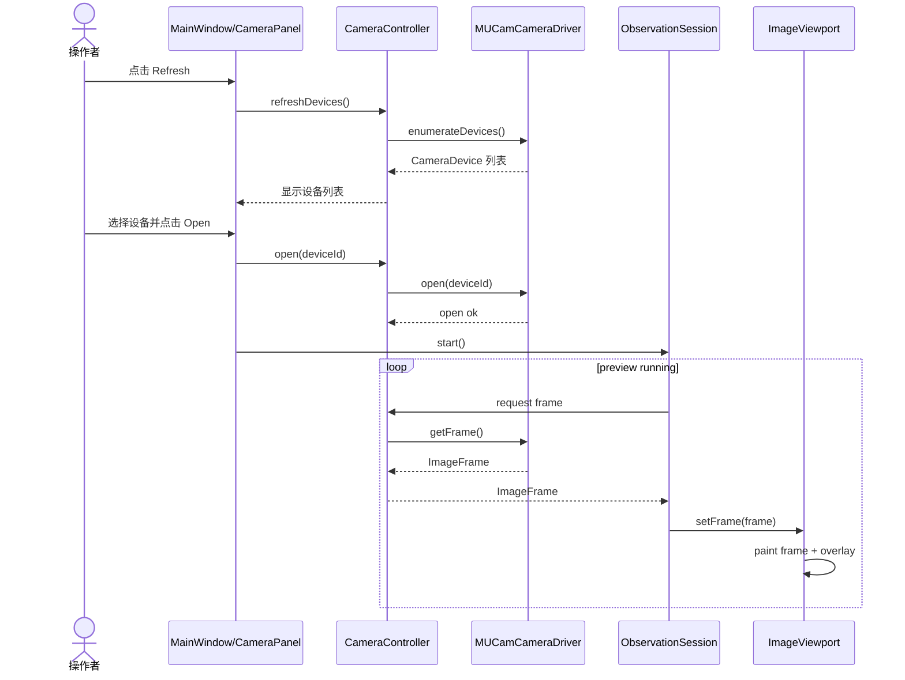

### 8.2 标定流程

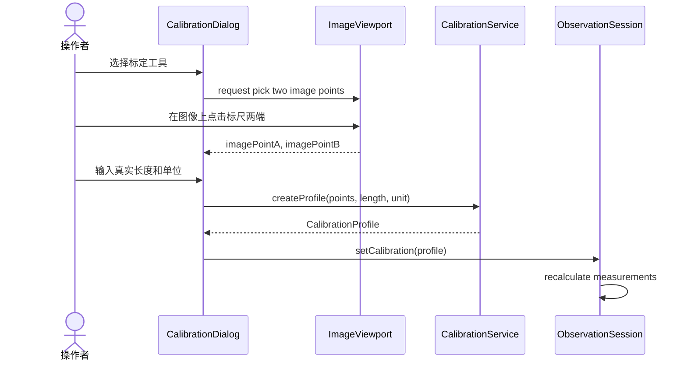

### 8.3 创建长度测量

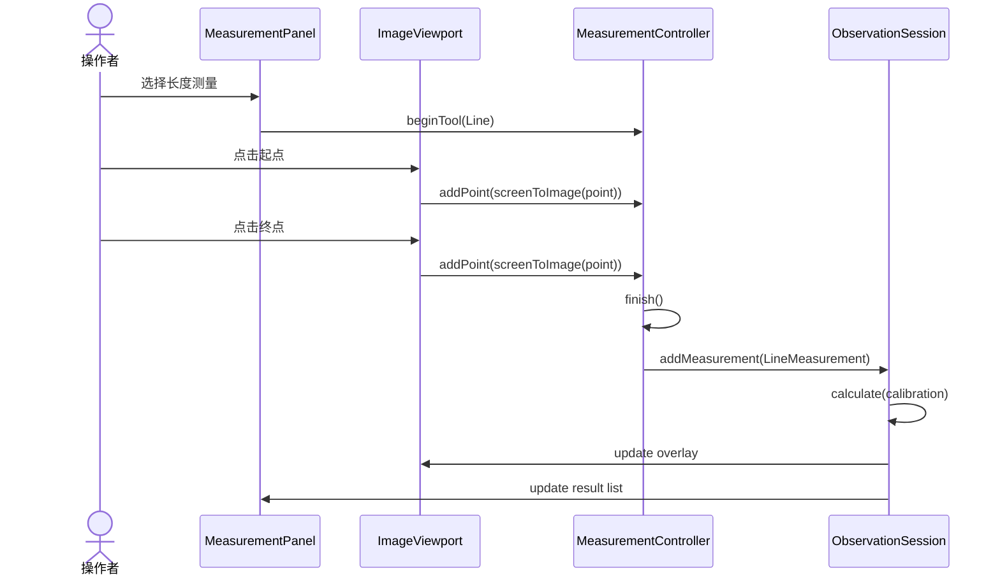

### 8.4 高级图像处理时序

高级图像处理的正式时序图独立维护在 PlantUML 图源中：

- `docs/uml/fluorescence_fusion_sequence.puml`：荧光通道选择、染料资料读取、融合配方应用和视口刷新。
- `docs/uml/stitching_sequence.puml`：拼接任务提交到后台队列，完成图块配准、融合和全景图发布。
- `docs/uml/edf_sequence.puml`：EDF 任务提交到后台队列，完成 Z 序列对齐、焦点图生成和合成图发布。

### 8.5 保存与导出时序

保存和导出流程的正式时序图独立维护在 PlantUML 图源中：

- `docs/uml/project_save_sequence.puml`：项目保存、项目读取、`ProjectDocument` 持久化、会话映射和项目重新打开后的运行态恢复。
- `docs/uml/export_sequence.puml`：测量 CSV 导出，以及原图或带叠加层图片导出。

## 9. 状态图

### 9.1 观察会话状态

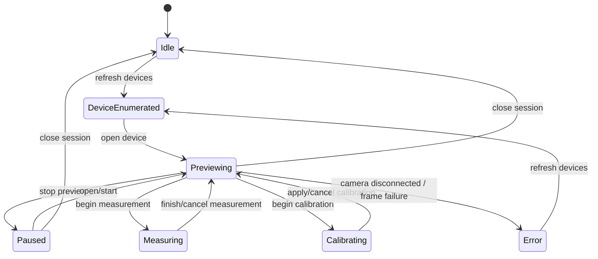

### 9.2 测量工具状态

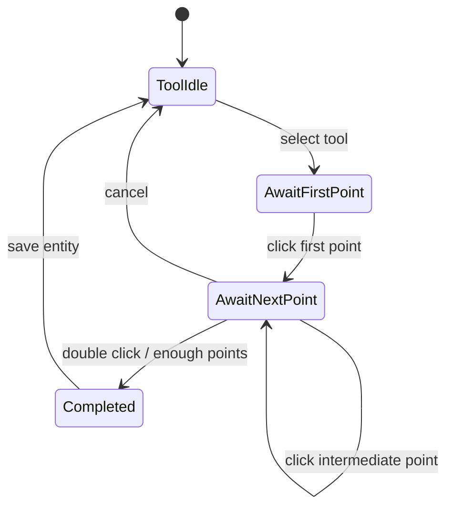

### 9.3 图像处理任务状态

拼接和 EDF 使用统一后台任务模型。正式状态图见 `docs/uml/processing_job_state.puml`。

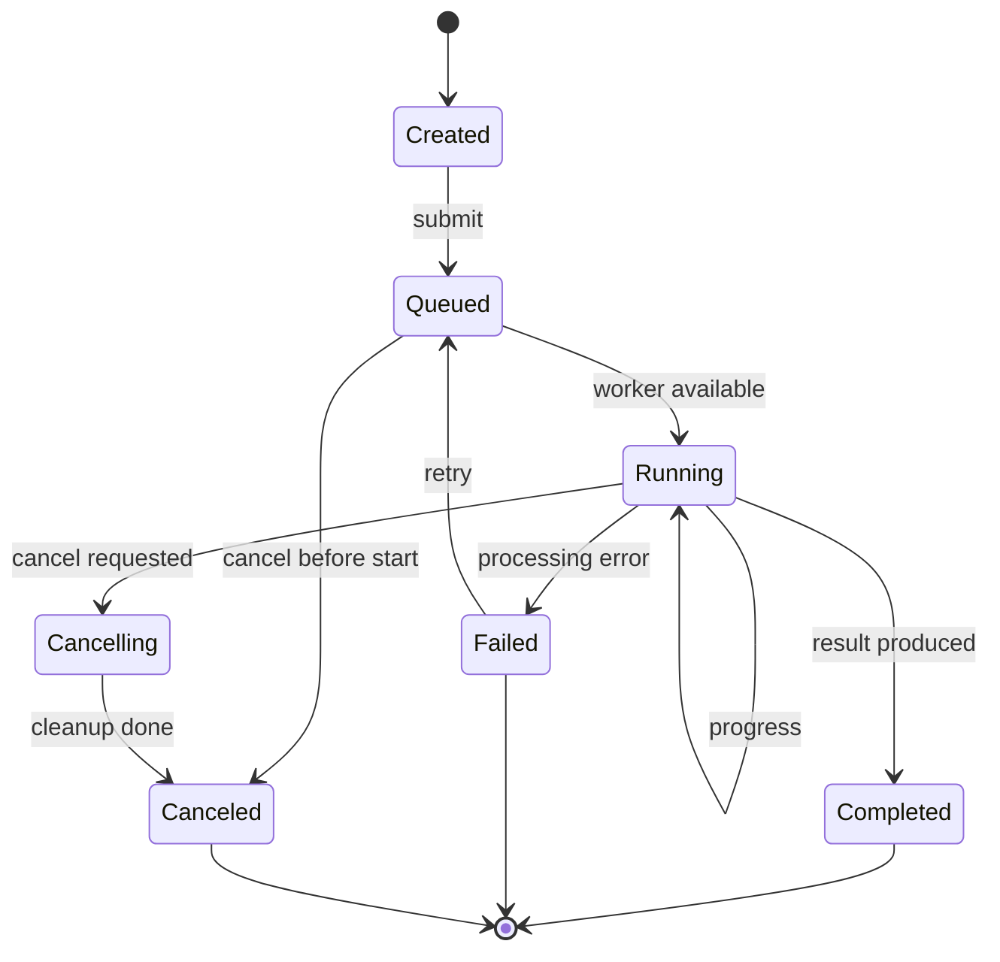

## 10. 坐标与缩放模型

测量必须统一使用图像坐标，不能使用屏幕坐标直接计算。

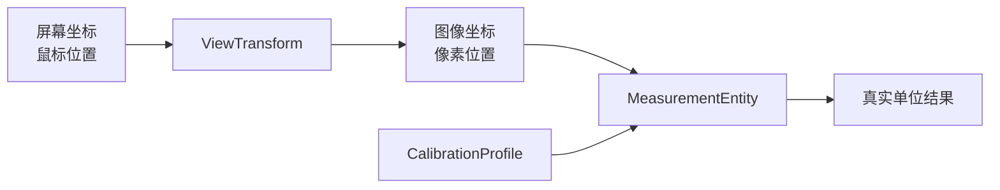

设计约束：

- 图像缩放、平移、适配窗口只改变 `ViewTransform`。
- 测量点保存为图像像素坐标。
- 标定参数负责像素到真实单位的转换。
- 叠加绘制时再把图像坐标转换成屏幕坐标。

### 10.1 图像处理扩展模型

伪彩、荧光融合、拼接和 EDF 都属于派生图像处理。处理结果可以用于显示、保存和测量，但原始图像、通道信息和处理参数需要保留，便于复查。

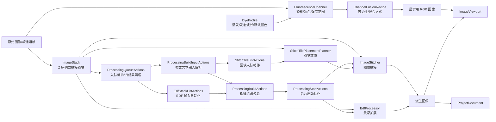

设计约束：

- 伪彩只改变显示映射，不修改原始灰度或单通道数据。
- 荧光通道融合由 `ChannelFusionRecipe` 记录每个通道的颜色、强度范围、可见性和混合方式。
- 荧光染料由 `DyeProfile` 管理，记录名称、激发波长、发射波长、默认显示颜色和备注。
- 图像拼接通过 `StitchingProject` 保存图块、位姿变换、重叠比例和融合参数；当前帧加入拼接队列的状态、无图像拒绝和入队文本由 `StitchTileListActions` 维护，拼接入队流程、成功入队后的旧处理结果清理和预览刷新请求由 `ProcessingQueueActions` 编排，拼接搜索文本输入由 `ProcessingBuildInputActions` 解析，点击构建前的空队列拒绝、搜索范围错误和启动输入拷贝由 `ProcessingBuildActions` 维护，后台启动前的运行态检查、旧 worker 回收回调、重试快照和作业编号创建由 `ProcessingStartActions` 维护。
- EDF 通过 `ImageStack` 和 `EdfResult` 保存 Z 序列、清晰度图和合成图；当前帧加入 EDF 堆栈的状态、无图像拒绝和帧数文本由 `EdfStackListActions` 维护，EDF 入队流程、成功入队后的旧处理结果清理和预览刷新请求由 `ProcessingQueueActions` 编排，EDF 半径文本输入由 `ProcessingBuildInputActions` 解析，点击构建前的栈长度拒绝、半径错误和启动输入拷贝由 `ProcessingBuildActions` 维护，后台启动前的运行态检查、旧 worker 回收回调、重试快照和作业编号创建由 `ProcessingStartActions` 维护。
- 拼接和 EDF 可能处理大图，后续实现时应放到后台任务，完成后再刷新视口。

## 11. 数据模型

| 对象 | 关键字段 | 说明 |
| --- | --- | --- |
| `ImageFrame` | width, height, format, timestamp, pixelBuffer | 当前帧或保存帧 |
| `ImageStack` | frames, zSpacing, calibration | Z 序列或一组待处理图像 |
| `ControlIds` | controlId | 当前已落地的 Win32 控件编号集中定义 |
| `WindowControlLayout` | clientRect, controlId, bounds, visible | 当前已落地的工具栏和右侧面板控件摆放计算对象 |
| `WindowControlDefinitions` | controlId, className, text, style | 当前已落地的 Win32 控件创建定义表 |
| `MeasurementActionApplier` | interactionAction, calibration, measurements, status | 当前已落地的测量交互动作到标定/测量对象的应用规则对象 |
| `MeasurementInteractionActions` | interaction, imagePoint, calibration, measurements, status | 当前已落地的测量点击点应用、多边形完成、无帧/坐标转换失败提示和刷新结果动作对象 |
| `MeasurementEditSession` | active, measurementReference, editablePoint, pointIndex | 当前已落地的测量点拖拽编辑会话状态和点位更新对象 |
| `MeasurementListActions` | selectedIndex, requestedName, measurements, nextSelection, status | 当前已落地的测量结果列表删除和重命名动作规则对象 |
| `MeasurementListSelection` | selectedIndex, itemCount, remainingCount | 当前已落地的测量结果列表选中索引和删除后下一选择项规则对象 |
| `MeasurementDisplayActions` | measurements, calibration, interaction, selectedIndex | 当前已落地的测量显示单位、结果列表文本、选中测量映射和叠加绘制模型入口对象 |
| `MeasurementOverlayModelBuilder` | measurements, calibration, displayUnit, pendingOverlay | 当前已落地的测量叠加绘制模型组装对象 |
| `MeasurementToolAvailability` | frame, startKind, status | 当前已落地的标定和测量工具启动前预览帧可用性判断对象 |
| `MeasurementToolStartActions` | interaction, availability, calibrationLength, calibrationUnit, status | 当前已落地的标定和测量工具启动动作、标定输入状态、交互状态切换和提示文本对象 |
| `FileDialog` | owner, filter, defaultName, defaultExtension, selectedPath | 当前已落地的 CSV、BMP、诊断报告和项目文件保存/打开对话框封装，BMP 可作为离线当前帧打开 |
| `DyeProfileFormParser` | name, excitationNm, emissionNm, rgb, status | 当前已落地的荧光染料资料输入解析和错误状态对象 |
| `DyeProfileFormPresenter` | dye, nameText, excitationText, emissionText, rgbText | 当前已落地的荧光染料资料表单显示文本和空表单默认值对象 |
| `DyeLibraryActions` | dyeProfiles, input, selectedIndex, nextSelection, status | 当前已落地的荧光染料资料保存、删除、状态文本和删除后下一选择项动作对象 |
| `FluorescenceDisplayActions` | dyes, selectedDyeIndex, channels, selectedChannelIndex | 当前已落地的染料下拉文本、当前染料选择、荧光通道列表文本和通道选中索引对象 |
| `CameraDevice` | id, displayName, type, index | 枚举到的相机 |
| `CameraPanelActions` | devices, selectedIndex, exposureText, range, status | 当前已落地的相机设备刷新结果、设备选择结果、曝光输入解析、曝光范围夹取和状态文本动作对象 |
| `CameraDeviceListFormatter` | devices, placeholder, selectedIndex | 当前已落地的相机设备下拉框占位文本、设备显示文本和选择索引映射对象 |
| `CameraControlStatusFormatter` | cameraCount, deviceIndex, exposureMs, previewState | 当前已落地的相机枚举、选择、打开、停止、断开和曝光设置状态文本格式化对象 |
| `CameraTelemetryFormatter` | deviceIndex, cameraType, resolution, fps, timestamp | 当前已落地的预览状态栏相机遥测文本格式化对象 |
| `ViewportInteractionActions` | panState, previewRect, frame, mousePoint, wheelDelta, zoomStatus | 当前已落地的滚轮缩放校验、缩放倍率状态文本、拖拽平移开始/过程/结束和平移状态动作对象 |
| `FluorescenceChannel` | name, sourceFrame, dyeId, color, visible, intensityMin, intensityMax | 单个荧光通道及显示设置 |
| `DyeProfile` | name, excitationNm, emissionNm, displayColor, notes | 荧光染料资料 |
| `DyeLibrary` | dyeProfiles, dyeName, selectedIndex | 当前已落地的默认染料、同名更新/新增、删除后下一选择项、空通道默认染料和下拉索引映射对象 |
| `FluorescenceChannelFactory` | dye, sourceFrame, sequenceIndex, displaySettings | 当前已落地的按染料和图像帧创建默认荧光通道对象 |
| `FluorescenceChannelFormPresenter` | channel, visible, blackLevelText, whiteLevelText | 当前已落地的荧光通道设置表单显示文本和空通道默认值对象 |
| `FluorescenceChannelListActions` | channels, sourceFrame, dye, selectedIndex, showFusionPreview, status | 当前已落地的荧光通道添加、清空、融合预览开关和添加后列表选中规则对象 |
| `FluorescenceChannelSettings` | visible, blackLevel, whiteLevel, selectedIndex | 当前已落地的荧光通道可见性、黑白强度范围和通道列表索引映射对象 |
| `FluorescenceChannelUpdater` | channels, selectedIndex, visible, blackLevel, whiteLevel | 当前已落地的荧光通道显示设置应用和错误状态对象 |
| `FluorescenceFormatter` | dye, channel, frameSize, levelRange, sequenceIndex | 当前已落地的荧光通道默认命名、染料下拉和荧光通道列表文本格式化对象 |
| `PseudoColorMapper` | palette, paletteIndex, sourceFrame | 当前已落地的伪彩选项顺序、下拉索引映射和图像伪彩映射对象 |
| `PreviewDisplayActions` | sourceFrame, processingFrames, fluorescenceChannels, pseudoPalette, status, modeLabel | 当前已落地的伪彩下拉显示、伪彩选择状态文本、当前预览帧构建和预览显示模式标签动作对象 |
| `ProcessingParameterRules` | stitchSearchPercent, edfFocusRadius, searchRadius | 当前已落地的拼接搜索百分比、EDF 清晰度半径、配准搜索半径和拼接优化参数规则对象 |
| `ProcessingBuildActions` | stitchTiles, stitchSearchPercent, edfStack, edfOptions, status | 当前已落地的拼接/EDF 构建请求前置校验和启动输入组装对象 |
| `ProcessingBuildInputActions` | inputText, stitchTiles, edfStack, parsedParameters | 当前已落地的拼接搜索和 EDF 半径文本输入解析、入队前搜索参数确认和构建动作转发对象 |
| `ProcessingQueueActions` | stitchTiles, edfStack, resultFrames, previewChanged, status | 当前已落地的拼接/EDF 入队编排、成功入队后的旧处理结果清理和预览刷新请求对象 |
| `ProcessingStartActions` | jobState, retryState, launch, status | 当前已落地的拼接/EDF 后台启动前运行态检查、旧 worker 回收回调、重试快照和作业编号创建动作对象 |
| `StitchTileListActions` | tiles, sourceFrame, searchPercent, status | 当前已落地的当前帧加入拼接队列、无图像拒绝、入队后 tile 数和状态文本对象 |
| `StitchTilePlacementPlanner` | frame, existingTiles, searchPercent, placementResult | 当前已落地的拼接图块自动配准放置和配准失败水平回退对象 |
| `EdfStackListActions` | stack, sourceFrame, status | 当前已落地的当前帧加入 EDF 堆栈、无图像拒绝、入队后帧数和状态文本对象 |
| `ProcessingJobExecutor` | jobId, kind, tiles, stack, progress, cancelToken, result | 当前已落地的拼接/EDF 后台作业算法执行和统一结果生成对象 |
| `ProcessingWorkerActions` | launch, statusCallback, publishCallback, workerThread | 当前已落地的拼接/EDF 后台 worker 创建、进度回调接线和结果发布动作对象 |
| `ProcessingPanelActions` | jobState, stitchTiles, edfStack, retryState, resultFrames | 当前已落地的 EDF 合成图/焦点图显示、处理队列清空、运行作业取消请求和旧结果失效动作对象 |
| `ProcessingRetryActions` | retryState, retryRequest, status | 当前已落地的拼接/EDF 重试可用性判定、重试请求传递和重试状态文本对象 |
| `ProcessingResultActions` | jobState, pendingResult, resultFrames, status | 当前已落地的后台完成结果取出、旧作业忽略、失败状态发布和成功结果显示动作对象 |
| `ProcessingProgressActions` | jobKind, cancelToken, progressThrottle, status | 当前已落地的拼接/EDF 后台进度取消检查、节流判定和状态文本动作对象 |
| `ProcessingProgressThrottle` | stepPercent, lastReportedPercent | 当前已落地的拼接/EDF 后台进度刷新节流对象 |
| `ChannelFusionRecipe` | blendMode, channels, backgroundMode | 多通道融合配方 |
| `CalibrationProfile` | unit, unitIndex, micronsPerPixelX, micronsPerPixelY, objectiveName | 标定比例、标定单位选项和单位索引映射 |
| `MeasurementEntity` | id, type, points, style, visible | 测量图元 |
| `MeasurementResult` | value, unit, displayText | 计算结果 |
| `MeasurementFormatter` | result, calibration, displayUnit | 当前已落地的测量列表、状态栏和叠加文本格式化对象 |
| `MeasurementNameFormatter` | measurementKind, sequenceIndex, collection | 当前已落地的测量对象默认名称格式化对象 |
| `StitchingProject` | tiles, transforms, overlapPercent | 图像拼接工程数据 |
| `EdfResult` | sourceStack, compositeFrame, focusMap | EDF 合成结果 |
| `ProcessingJob` | id, type, status, progress, sourceRefs, resultRef | 拼接、EDF 等后台处理任务 |
| `ProcessingJobState` | running, activeJobId, cancelToken, pendingResult | 当前已落地的后台作业状态和结果发布辅助对象 |
| `ProcessingResultFrames` | processingResult, edfCompositeFrame, edfFocusMap, visible, displaySource | 当前已落地的拼接/EDF 完成结果、EDF 合成图/焦点图切换、当前处理结果显示状态和显示来源标签对象 |
| `ProcessingRetryState` | kind, stitchTiles, stitchSearchPercent, edfStack, edfOptions | 当前已落地的拼接/EDF 后台处理重试快照对象 |
| `ProcessingStatusFormatter` | jobKind, progress, imageSize, relationCount | 当前已落地的拼接/EDF 后台作业状态文本格式化对象 |
| `ExportActions` | path, measurements, frame, report, status | 当前已落地的 CSV、BMP 和诊断报告保存动作与状态文本对象；8 位灰度/调色板、24 位和 32 位 BGRA BMP 读取由 `ImageExporter` 直接作为当前帧输入 |
| `ProjectActions` | path, calibration, measurements, dyes, channels, processingSettings, status | 当前已落地的项目保存、项目读取、会话映射和文件读写状态对象 |
| `DiagnosticReportActions` | status, telemetry, sdk, devices, frameSource, frame, measurements, processingSummary | 当前已落地的现场诊断状态快照组装、SDK 遥测摘要、设备列表摘要、当前帧来源和报告文本入口对象 |
| `DiagnosticReportBuilder` | generated, sdk, devices, frameSource, frame, measurementSummary, processingSummary | 当前已落地的现场诊断报告文本构建器，包含枚举设备列表、选中设备、当前帧来源、当前预览显示模式、拼接/EDF 结果类型、当前显示来源、尺寸和 EDF 合成图/焦点图可用性 |
| `ProjectSessionMapper` | calibration, measurements, dyes, channelRecipes, processingSettings | 当前已落地的会话状态与项目文档互转对象 |
| `ProjectSessionRestorer` | projectState, runtimeState, processingQueues, status | 当前已落地的项目打开后运行态恢复和旧处理队列清理对象 |
| `ProjectDocument` | imageRefs, calibration, measurements, notes | 项目保存内容 |

建议项目文件先使用 JSON 保存元数据，图片单独保存为 BMP/PNG。项目元数据应包含标定、测量、荧光通道、染料引用、融合配方、拼接参数和 EDF 参数。后续如果需要审计追踪，再增加版本字段和操作日志。

图像处理算法和数据保真策略见 `docs/image_processing_design.md`。第一阶段要求是原始图像只读保存，伪彩、融合、拼接和 EDF 生成派生图像，并保留源图引用和处理参数。

## 12. 线程模型

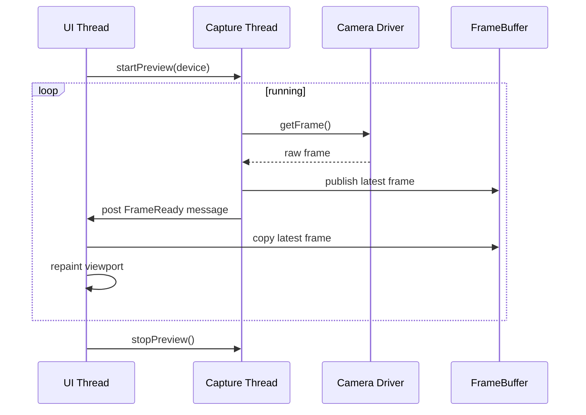

线程规则：

- UI 线程只处理窗口、鼠标、绘制和轻量状态更新。
- 采集线程只负责调用 `ICameraDriver`、接收 `ImageFrame` 并通过 `FrameBuffer` 发布最新帧。
- 拼接、EDF 等大图处理应放入 `ProcessingQueue` 后台任务，UI 只接收进度、取消结果和完成通知。
- 测量实体读写由应用层统一管理，避免 UI 和采集线程同时改同一份数据。
- MUCam SDK 调用、Bayer/RGB 转换和互斥保护封装在 `MUCamCameraDriver` 内部。

## 13. 第一阶段实现计划

本设计已确认，建议按以下顺序实现：

1. 抽出 `camera/ICameraDriver` 和 `camera/MUCamCameraDriver`，让现有 `MUCamApi` 变成驱动内部实现。
2. 抽出 `ImageFrame`、`FrameBuffer`、`CameraPanelActions`、`CameraDeviceListFormatter`、`CameraControlStatusFormatter`、`CameraTelemetryFormatter`、`MeasurementActionApplier`、`MeasurementDisplayActions`、`MeasurementInteractionActions`、`MeasurementInteractionState`、`MeasurementHitTester`、`MeasurementEditSession`、`MeasurementListActions`、`MeasurementListSelection`、`MeasurementOverlayModelBuilder`、`MeasurementToolAvailability`、`MeasurementToolStartActions`、`MeasurementCollection`、`MeasurementFormatter`、`MeasurementNameFormatter`、`MeasurementCsvExporter`、`ExportActions`、`ProjectActions`、`DiagnosticReportActions`、`DiagnosticReportBuilder`、`ProjectSessionMapper`、`ProjectSessionRestorer`、`FileDialog`、`TextInputParser`、`DyeProfileFormParser`、`DyeProfileFormPresenter`、`DyeLibraryActions`、`DyeLibrary`、`FluorescenceDisplayActions`、`FluorescenceChannelFactory`、`FluorescenceChannelFormPresenter`、`FluorescenceChannelListActions`、`FluorescenceChannelSettings`、`FluorescenceChannelUpdater`、`FluorescenceFormatter`、`ProcessingParameterRules`、`ProcessingBuildActions`、`ProcessingBuildInputActions`、`ProcessingStartActions`、`ProcessingProgressActions`、`ProcessingWorkerActions`、`StitchTileListActions`、`StitchTilePlacementPlanner`、`EdfStackListActions`、`ProcessingJobExecutor`、`ProcessingPanelActions`、`ProcessingRetryActions`、`ProcessingResultActions`、`ProcessingProgressThrottle`、`ProcessingResultFrames`、`ProcessingRetryState`、`ProcessingStatusFormatter`、`PreviewDisplayActions`、`PreviewFrameComposer`、`ProcessingJobState`、`ViewportInteractionActions`、`ControlIds`、`WindowLayout`、`WindowControlLayout`、`WindowControlDefinitions`、`ViewTransform`、`ImageViewport`、`OverlayRenderer`，把最新帧缓冲、相机设备刷新动作、相机设备下拉显示、相机控制状态文本、相机遥测文本、测量交互动作应用、测量显示单位、列表文本、选中测量和叠加模型入口、测量点击和完成动作、测量工具点位采集状态、测量点命中检测、测量点拖拽编辑会话、测量列表删除和重命名动作、测量列表选择规则、测量叠加模型组装、测量工具启动帧可用性判断、测量工具启动动作、测量集合管理、测量文本格式化、测量默认命名、CSV 导出、导出动作状态、项目保存和读取动作状态、诊断报告状态组装、诊断报告生成、项目会话映射、项目打开运行态恢复、文件保存/打开对话框、输入解析、染料资料输入解析、染料资料表单显示、染料资料保存和删除动作、染料库更新删除规则、荧光显示列表和选择动作、荧光通道创建、荧光通道设置表单显示、荧光通道添加和清空动作、荧光通道显示设置、荧光通道显示设置应用、荧光通道命名和显示文本格式化、处理参数范围和搜索半径规则、处理参数文本输入、处理构建请求动作、后台处理启动动作、后台进度回调动作、后台 worker 创建动作、拼接图块列表入队动作、拼接图块自动放置和失败回退、EDF 堆栈入队动作、后台作业算法执行、处理面板清空和焦点图动作、后台处理重试动作、后台结果发布动作、后台进度刷新节流、后台处理结果显示帧状态、后台处理重试快照、后台作业状态文本、预览显示动作和伪彩选择状态、预览帧合成、视口缩放和平移动作、后台作业状态、控件编号、窗口区域布局、控件摆放、控件创建定义、预览绘制、缩放和测量叠加绘制从 `main.cpp` 拆出。
   - 最新补充：`ProcessingQueueActions` 已把拼接/EDF 入队编排、成功入队后的旧处理结果清理和预览刷新请求从 `main.cpp` 拆出。
3. 继续抽出 `MainWindow`，保留 Win32 UI，但减少 `main.cpp` 单文件体积。
4. 增加 `CalibrationProfile` 和坐标转换基础。
5. 实现长度测量作为第一种测量实体。
6. 增加测量结果列表、删除、清空。
7. 增加项目保存和 CSV 导出。
8. 增加伪彩、荧光通道融合和染料资料管理。
9. 增加图像拼接和 EDF 景深扩展，优先支持导入已有图像序列。

### 13.1 技术实现建议

第一阶段建议继续使用 Visual Studio C++/MSVC 和 CMake 管理工程，原因是现有 MUCam SDK、Windows 原生窗口和动态 DLL 加载都已经沿这个方向工作。图像处理算法层建议通过独立 `imaging/` 模块封装，后续可接入 OpenCV 等开源图像处理库，但 UI 和领域模型不直接依赖第三方库类型。

依赖隔离原则：

- `camera/` 只适配 MUCam SDK，不暴露 SDK 句柄给 UI 和测量模块。
- `imaging/` 可封装伪彩、融合、拼接、EDF 算法，不把算法库对象写进 `ProjectDocument`。
- `storage/` 负责 JSON 元数据、图片文件和导出格式，避免 UI 直接写文件。
- `app/` 只编排流程和任务，不做像素级算法。

## 14. 已确认问题

以下设计点已按默认方案确认，后续如需变更再追加设计决策：

1. 第一版测量工具是否按“长度、角度、圆/直径、矩形面积、任意多边形面积”实现？
2. 标定方式是否先做“两点标定 + 输入真实长度”，后续再增加物镜倍率预设？
3. 项目保存格式是否接受“JSON 元数据 + 图像文件”的方式？
4. UI 是否继续使用当前 Win32 原生窗口，还是希望后续迁移到 Qt？
5. 测量结果导出是否先支持 CSV，报告/PDF 放到下一阶段？
6. 荧光通道融合第一版是否先支持 2-4 个通道、加法融合和强度范围调节？
7. 荧光染料资料是否需要预置常见染料，还是先做用户自定义管理？
8. 图像拼接第一版是否先支持导入多张图片进行拼接，自动扫描采集放到后续？
9. EDF 第一版是否先支持导入 Z 序列图片，后续再联动电动 Z 轴采集？

## 15. 设计确认清单

以下默认方案已确认：

| 确认项 | 默认建议 | 状态 |
| --- | --- | --- |
| UI 技术路线 | 第一阶段继续 Win32，后续按需要迁移 Qt | 已确认 |
| 相机驱动抽象 | 使用 `ICameraDriver` + `MUCamCameraDriver` | 已确认 |
| 测量坐标基准 | 只保存图像像素坐标，不保存屏幕坐标 | 已确认 |
| 标定方式 | 第一阶段两点标定，保存 microns-per-pixel | 已确认 |
| 第一批测量工具 | 长度、角度、圆/直径、矩形面积、多边形面积 | 已确认 |
| 项目存储 | JSON 元数据 + 图像文件 | 已确认 |
| 导出能力 | 第一阶段 CSV，报告/PDF 后续扩展 | 已确认 |
| 荧光伪彩和融合 | 先支持单通道伪彩、2-4 通道融合、强度范围调节 | 已确认 |
| 荧光染料管理 | 支持自定义染料，字段包含激发/发射波长和默认颜色 | 已确认 |
| 图像拼接 | 先支持多图导入和重叠配准，自动扫描采集后续扩展 | 已确认 |
| EDF 景深扩展 | 先支持导入 Z 序列合成，电动 Z 轴联动后续扩展 | 已确认 |
| 后台处理模型 | 拼接、EDF 使用 `ProcessingQueue`，支持进度、失败、取消和重试 | 已确认 |
| 代码拆分节奏 | 先抽相机/帧/视图变换，再做测量 | 已确认 |
